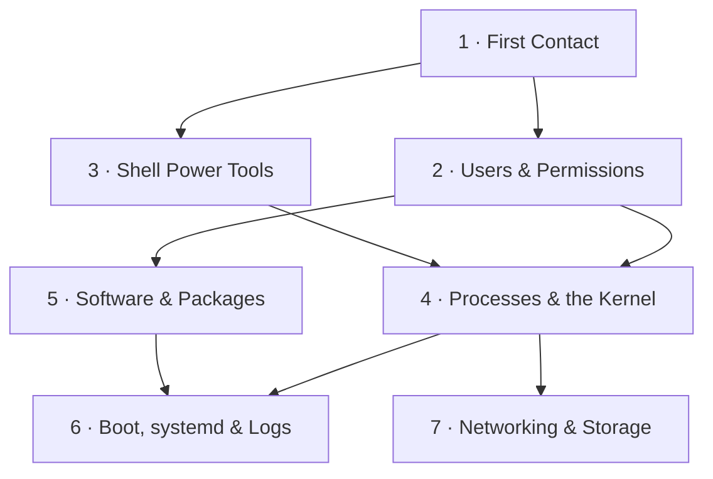

# Linux from the Command Line · Ubuntu 26.04 LTS

**Learn how Linux actually works by living in the terminal.** By the end of this course you can navigate, administer, and debug an Ubuntu 26.04 system from the command line - and explain what the kernel, the shell, systemd, and the filesystem are each doing under the hood.

Built for Ubuntu 26.04 LTS "Resolute Raccoon" (Linux kernel 7.0), but almost everything transfers to any modern Linux.

## How to use this course

- Work through it in a terminal on a real or virtual Ubuntu 26.04 machine. Reading alone will not stick - every lesson ends with a hands-on exercise.
- You do not have to go in order. The map below shows what depends on what: follow the arrows for the guided path, or jump to whatever pulls you.
- Tick off modules in the progress tracker as you finish them (edit this file - the checkboxes are real).

## Course map

Modules 2 and 3 are independent - do them in either order. Modules 6 and 7 are also independent of each other.

## Modules

| # | Module | What you'll be able to do | Status |
|---|--------|---------------------------|--------|
| 1 | [First Contact](module-01-first-contact/README.md) | Explain what Linux is made of, move around the filesystem, manage files, and find help without leaving the terminal | ✅ written |
| 2 | [Users & Permissions](module-02-users-and-permissions/README.md) | Read and set ownership and permissions, use sudo safely, understand links and inodes | 📝 planned |
| 3 | [Shell Power Tools](module-03-shell-power-tools/README.md) | Chain commands with pipes, search and transform text, write your first shell scripts | 📝 planned |
| 4 | [Processes & the Kernel](module-04-processes-and-the-kernel/README.md) | Inspect and control running processes, read /proc, watch programs talk to the kernel | 📝 planned |
| 5 | [Software & Packages](module-05-software-and-packages/README.md) | Install, upgrade, and investigate software with apt, dpkg, and snap | 📝 planned |
| 6 | [Boot, systemd & Logs](module-06-boot-systemd-and-logs/README.md) | Trace the boot process, manage services and timers, hunt through logs with journalctl | 📝 planned |
| 7 | [Networking & Storage](module-07-networking-and-storage/README.md) | Diagnose network problems, use SSH like a pro, manage disks, filesystems, and mounts | 📝 planned |

## Progress tracker

- [ ] Module 1 · First Contact
- [ ] Module 2 · Users & Permissions
- [ ] Module 3 · Shell Power Tools
- [ ] Module 4 · Processes & the Kernel
- [ ] Module 5 · Software & Packages
- [ ] Module 6 · Boot, systemd & Logs
- [ ] Module 7 · Networking & Storage

## What's new in Ubuntu 26.04 that this course covers

Ubuntu 26.04 LTS shipped in April 2026 with some changes that older tutorials will not mention:

- **Rust core utilities by default.** Most classic commands (`ls`, `cat`, `head`, ...) are now the memory-safe [uutils](https://uutils.github.io/) rewrites, with `cp`, `mv`, and `rm` still GNU for now. Day to day they behave the same; this course flags the rare differences.
- **`sudo` is sudo-rs.** A Rust reimplementation of sudo. Same command, same muscle memory, smaller attack surface.
- **Linux kernel 7.0** and a Wayland-only GNOME 50 desktop - though this course lives in the terminal, where none of that will slow you down.
- Five years of free security updates (to April 2031), ten with Ubuntu Pro.
