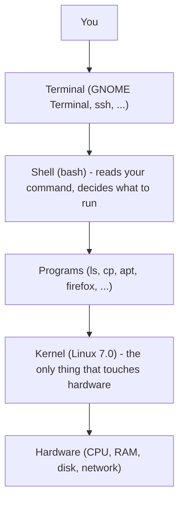

# 1 · What Linux actually is

> **You'll learn:** to tell the kernel, the shell, and the distribution apart - and to identify the exact version of each running on your machine.

## Why this matters

"Linux" gets used to mean at least four different things, and error messages, documentation, and forum answers assume you know which one they're talking about. Once you can separate the layers, sentences like "that's a shell feature, not a kernel feature" stop being noise and start telling you where to look.

## The big picture

A Linux system is a stack. Each layer only talks to the ones next to it:



When you type `ls` and press Enter: the terminal hands your keystrokes to the **shell**, the shell finds and starts the **program** `ls`, and `ls` asks the **kernel** to read the directory from disk. "Ubuntu" is not on the diagram because Ubuntu is the whole bundle - a **distribution** is a kernel plus thousands of programs, packaged and tested to work together.

## The kernel: the only real "Linux"

Strictly, *Linux* is just the kernel: the program that owns the hardware. It decides which process gets the CPU, manages memory, talks to disks and network cards, and enforces permissions. Everything else on the system has to go through it.

Ask your machine which kernel it runs:

```console
$ uname -r
7.0.0-14-generic
```

That `7.0` is the upstream Linux version; the rest is Ubuntu's packaging of it. You will rarely interact with the kernel directly, but module 4 shows how every program constantly does.

## Userland: the programs around the kernel

Everything that is not the kernel is *userland*: `ls`, `cp`, `bash`, your editor, the desktop. The core file and text utilities are called **coreutils**, and Ubuntu 26.04 made a quiet historic change here: most of them are now [uutils](https://uutils.github.io/), Rust rewrites of the classic GNU tools, chosen for memory safety.

```console
$ ls --version | head -1
ls (uutils coreutils) 0.8.0
```

Day to day they behave identically to the GNU versions. `cp`, `mv`, and `rm` are still GNU in 26.04, and `sudo` is now **sudo-rs**, a Rust reimplementation with the same interface.

> [!NOTE]
> This is why the pedantic name for a typical system is "GNU/Linux": historically the kernel was Linux and most userland was GNU. Ubuntu 26.04 makes that name slightly less accurate every release.

## The shell: your command interpreter

The shell is just another program - one whose job is to read lines you type, expand shortcuts like `*` and `~`, and launch other programs. Ubuntu's default interactive shell is **bash**.

```console
$ echo $SHELL
/bin/bash
```

The window the shell lives in (GNOME Terminal, an ssh session, the WSL window) is the **terminal** - it draws text and forwards keystrokes, nothing more. Shell and terminal are different programs, which is why you can run the same bash over ssh from another computer.

## The distribution: Ubuntu

A distribution takes the kernel and userland, adds a package manager, an installer, default configuration, and a support promise. Ubuntu 26.04 LTS "Resolute Raccoon":

```console
$ lsb_release -a
Distributor ID: Ubuntu
Description:    Ubuntu 26.04 LTS
Release:        26.04
Codename:       resolute
```

| Fact | Meaning |
|---|---|
| `26.04` | Released April 2026 (Ubuntu versions are `year.month`) |
| LTS | Long Term Support: free security updates until April 2031 |
| Interim releases (25.10, 26.10, ...) | Supported only 9 months - servers and learners should stick to LTS |

Debian, Fedora, and Arch are other distributions: same kernel, different packaging, different philosophies. Skills from this course transfer to all of them.

<details>
<summary>🔍 Deep dive: what happens in the two seconds after you press Enter on <code>ls</code></summary>

1. The terminal sends the characters `l`, `s`, `\n` to bash through a *pseudo-terminal* (a kernel-provided pipe that pretends to be 1970s serial hardware).
2. bash parses the line, sees no special characters, and searches the directories in its `$PATH` variable for an executable called `ls`, finding `/usr/bin/ls`.
3. bash asks the kernel to `fork` (clone itself) and `exec` (replace the clone with `ls`). Those are *system calls* - the function calls programs make into the kernel.
4. `ls` calls `openat` and `getdents64` system calls to read the directory, `write` to print the result, and `exit`.
5. The kernel tells bash its child finished; bash prints the next prompt.

Every command you ever run is a variation of this. Module 4 lets you watch it live with `strace`.

</details>

## 🛠️ Try it

Build a one-page "system identity card" for your machine. Create a file `exercises/identity.txt` (module 1 teaches file management next lesson, so for now just run the commands and paste the output into any editor) answering:

1. Kernel version - `uname -r`
2. Full kernel build info - `uname -a`
3. Distribution and codename - `lsb_release -a`
4. Your shell - `echo $SHELL`
5. Are your coreutils Rust or GNU? Check both `ls --version | head -1` and `cp --version | head -1`
6. How long since last boot - `uptime`

<details>
<summary>💡 Hint</summary>

Every command above is complete - type it exactly. If `lsb_release` is missing (minimal containers), try `cat /etc/os-release` instead.

</details>

<details>
<summary>✅ Expected shape of the answers</summary>

```text
kernel:   7.0.0-14-generic
build:    Linux mybox 7.0.0-14-generic #14-Ubuntu SMP ... x86_64 GNU/Linux
distro:   Ubuntu 26.04 LTS (resolute)
shell:    /bin/bash
ls:       ls (uutils coreutils) 0.8.0      <- Rust
cp:       cp (GNU coreutils) 9.x           <- still GNU in 26.04
uptime:   ... up 2 days, 3:14, 1 user ...
```

Exact numbers will differ - what matters is knowing which command answers which question.

</details>

## ✋ Checkpoint

1. You read a blog post saying "Linux 7.0 added a new scheduler". Which layer of the stack changed - and does upgrading Ubuntu 26.04's `bash` package get you the new scheduler?
2. A friend on Fedora runs the same `uname -r` and gets `7.0.3-something`. Same Linux or different Linux as your Ubuntu box?
3. What does the terminal do with `ls` when you press Enter - does it run it?

<details>
<summary>Answers</summary>

1. The kernel changed. Upgrading bash does nothing for the scheduler - bash is userland; the scheduler lives in the kernel, updated via kernel packages.
2. Same kernel project (Linux 7.0.x), different distribution around it. The kernel is the shared core of every distro.
3. No - the terminal only forwards your keystrokes to the shell. The shell (bash) finds and runs `ls`.

</details>

## 📚 Further reading

- [Ubuntu 26.04 LTS release notes](https://documentation.ubuntu.com/release-notes/26.04/) - what shipped in the release you're running
- [uutils coreutils](https://uutils.github.io/) - the Rust coreutils project now powering Ubuntu's basic commands
- [The Linux Kernel Archives](https://www.kernel.org/) - where the kernel itself lives; look at the release cadence

---

🗺️ [Course map](../README.md) · ➡️ [Next: Navigating the filesystem](02-navigating-the-filesystem.md)
