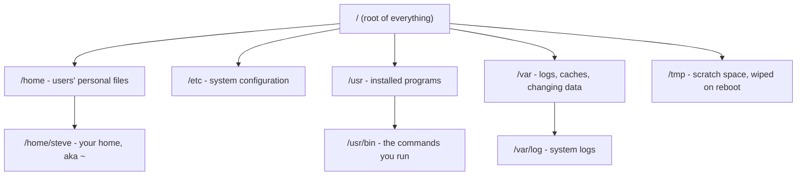

# 2 · Navigating the filesystem

> **You'll learn:** to move anywhere in the filesystem with `cd`, see where you are and what's around you, and know what the top-level directories are for.

## Why this matters

On Linux, *everything* is reached through one big tree of directories: your documents, installed programs, configuration, even hardware devices. Every log you'll ever read and every config you'll ever edit has an address in this tree. Navigation is the skill under every other skill.

## The big picture

There are no drive letters. One tree, starting at the **root** directory `/`:



Three commands do 90% of navigation:

```console
$ pwd            # where am I?  (print working directory)
/home/steve
$ ls             # what's here?
Desktop  Documents  Downloads
$ cd Documents   # go there     (change directory)
```

## You are always somewhere

Every shell has a **working directory** - the place commands act on by default. `pwd` prints it, and your prompt usually shows it too:

```console
steve@mybox:~/Documents$ pwd
/home/steve/Documents
```

The `~` in the prompt is shorthand for your **home directory**, `/home/steve` - the one place that's yours, where your files, settings, and this course's exercises live.

## Paths: absolute and relative

A **path** is an address in the tree. Two flavours:

| Path | Type | Meaning |
|---|---|---|
| `/var/log/syslog` | Absolute (starts with `/`) | Same file no matter where you are |
| `notes/todo.txt` | Relative | `todo.txt` inside `notes`, *inside the current directory* |
| `.` | Relative | The current directory itself |
| `..` | Relative | The parent directory (one level up) |
| `~/Downloads` | `~` expands to home | `/home/steve/Downloads` |

```console
$ cd /var/log        # jump anywhere with an absolute path
$ cd ..              # up one level, now in /var
$ cd -               # back to wherever you were before
$ cd                 # no argument: straight home
```

> [!TIP]
> Press **Tab** while typing a path and the shell completes it. Press Tab twice to list the options. Nobody types full paths by hand - tab completion is how people move fast and avoid typos.

## Looking around with ls

```console
$ ls                 # names only
$ ls -l              # long: permissions, owner, size, date
$ ls -a              # all: include hidden files (names starting with .)
$ ls -lh /var/log    # of another directory, human-readable sizes
```

Files starting with a dot (`.bashrc`, `.ssh`) are **hidden** - not secret, just tucked away by convention because they're configuration you rarely browse.

```console
$ ls -la ~
drwxr-x--- 14 steve steve 4096 Jul 10 09:12 .
drwxr-xr-x  3 root  root  4096 Jun 01 08:00 ..
-rw-r--r--  1 steve steve 3771 Jun 01 08:00 .bashrc
drwxr-xr-x  2 steve steve 4096 Jul 09 17:40 Documents
```

The cryptic left column is permissions - module 2's whole topic. For now: lines starting `d` are directories, `-` are files.

## What lives where: the FHS

The layout is standardized (the *Filesystem Hierarchy Standard*), so knowledge transfers across machines and distros. The ones worth memorizing:

| Directory | What's in it | You'll go there when... |
|---|---|---|
| `/home` | Users' personal files | always - it's home |
| `/etc` | System-wide configuration (text files!) | changing how a service behaves |
| `/usr/bin` | Programs installed by packages | checking what a command actually is |
| `/var/log` | Logs | anything misbehaves |
| `/tmp` | Scratch space, cleared on reboot | you need a throwaway file |
| `/proc`, `/sys` | Live windows into the kernel (module 4) | inspecting processes and hardware |
| `/root` | The admin user's home (not `/`!) | rarely |
| `/boot` | Kernel images for startup (module 6) | managing kernels |

<details>
<summary>🔍 Deep dive: "everything is a file"</summary>

Unix's central design idea: nearly everything is presented as a file in this one tree, so the same tools work on all of it.

- `/dev/sda` - your first disk, as a file
- `/dev/null` - a file that discards whatever you write to it
- `/proc/cpuinfo` - your CPU's details, generated live by the kernel; try `cat /proc/cpuinfo`
- `/sys/class/power_supply/BAT0/capacity` - laptop battery percentage, as a file

No special "get battery level" API needed - you just *read a file*. This is why text tools are so powerful on Linux, and why this course spends a whole module on them.

</details>

## 🛠️ Try it

A scavenger hunt, using only `cd`, `ls`, `pwd`, and Tab completion. From your home directory:

1. Find the file that lists every user account on the system (it's in `/etc`, name contains `passwd`). Confirm with `ls -l` that it's there.
2. Go to `/var/log` and find the biggest file (`ls -lhS` sorts by size). Note its name.
3. Print your CPU model by reading a file under `/proc` (hint above).
4. From `/var/log`, get back home in one command, then return to `/var/log` in one command.
5. Count how many commands are installed: `ls /usr/bin | wc -l` (a preview of pipes, module 3).

<details>
<summary>💡 Hint 1</summary>

For step 1: `cd /etc`, then type `ls pass` and press Tab. For step 3: `cat /proc/cpuinfo` prints a lot - just eyeball the `model name` line for now.

</details>

<details>
<summary>✅ Solution</summary>

```console
$ ls -l /etc/passwd                 # 1: the user account list
$ cd /var/log && ls -lhS | head     # 2: biggest files first
$ cat /proc/cpuinfo                 # 3: look for "model name"
$ cd                                # 4a: home in one command
$ cd -                              # 4b: back to previous directory
$ ls /usr/bin | wc -l               # 5: usually 1500-2500 on desktop Ubuntu
```

</details>

## ✋ Checkpoint

1. You are in `/home/steve/projects` and run `cd ../..`. Where are you now?
2. `ls notes.txt` works but `ls /notes.txt` fails with "No such file or directory". Why?
3. Which directory would you search first for the configuration of the ssh service - `/usr/bin`, `/etc`, or `/var/log`?
4. Predict the output: `cd /tmp && pwd && cd && pwd`

<details>
<summary>Answers</summary>

1. `/home` - each `..` goes up one level: projects → steve → home.
2. The first is a relative path (notes.txt in the current directory); the second is absolute, claiming the file sits at the root of the whole tree, where it doesn't exist.
3. `/etc` - configuration lives in `/etc` (it's `/etc/ssh/`). `/usr/bin` holds the programs, `/var/log` the logs.
4. `/tmp` then `/home/<you>` - bare `cd` always goes home.

</details>

## 📚 Further reading

- [Filesystem Hierarchy Standard](https://refspecs.linuxfoundation.org/FHS_3.0/fhs/index.html) - the official map of what goes where
- `man hier` - the same map, already on your machine (lesson 4 teaches `man`)

---

⬅️ [Previous: What Linux actually is](01-what-linux-actually-is.md) · 🏠 [Course home](../README.md) · ➡️ [Next: Working with files](03-working-with-files.md)
