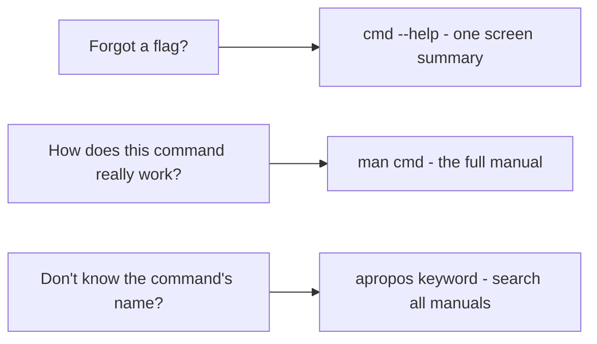

# 4 · Getting help

> **You'll learn:** to answer "what does this command do and what flags does it take?" entirely from your own machine, using man pages, `--help`, and search tools.

## Why this matters

You cannot memorize the command line - nobody has. What experts actually memorize is *how to look things up fast*. The documentation for nearly everything is already installed on your machine, works offline, and matches your exact installed version, which a blog post from 2019 does not.

## The big picture

Three lookups cover almost every situation, from quickest to deepest:



```console
$ ls --help | head -3            # quick reminder
$ man ls                         # the full story (opens in less: /, n, q work)
$ apropos rename                 # "I want to rename things but forget the command"
```

## man: the manual

Every standard command ships a manual page. `man ls` opens it in `less`, so everything from lesson 3 applies: `/pattern` to search, `n` for next match, `q` to quit.

Man pages share a skeleton - learn it once, read any of them:

| Section | What it tells you |
|---|---|
| NAME | one-line summary (this is what `apropos` searches) |
| SYNOPSIS | the shape of the command: `ls [OPTION]... [FILE]...` |
| DESCRIPTION | every option, in detail |
| EXAMPLES | (when you're lucky) worked examples - jump here first |
| SEE ALSO | related commands - great for discovery |

Reading a SYNOPSIS: things in `[brackets]` are optional, `...` means repeatable, **bold** is typed literally, *italic/underlined* is a placeholder you fill in.

> [!TIP]
> Inside a long man page, don't scroll - search. `man rsync` then `/delete` beats reading 3000 lines. Capital `G` jumps to the end where EXAMPLES and SEE ALSO live.

## The manual has chapters

Sometimes one name has several pages: `passwd` is both a command and a file format. The manual is split into numbered sections:

| # | Contents | Example |
|---|---|---|
| 1 | User commands | `man 1 passwd` - the password-changing command |
| 5 | File formats | `man 5 passwd` - the format of /etc/passwd |
| 8 | Admin commands | `man 8 mount` |
| 2 / 3 | Kernel syscalls / C library | `man 2 open` (module 4 territory) |

`man passwd` gives you section 1 by default; `man 5 passwd` asks for the file format. When documentation says `passwd(5)`, that's what the parenthesized number means.

## Finding commands you don't know

```console
$ apropos compress            # search all NAME lines for a keyword
xz (1)        - Compress or decompress .xz files
gzip (1)      - compress or expand files
zstd (1)      - zstd, zstdmt, unzstd, zstdcat - Compress or decompress ...
$ whatis gzip                 # just the one-liner for a known command
$ man -k compress             # identical to apropos
```

And to find out what a command *is* before trusting it:

```console
$ type cd
cd is a shell builtin
$ type ls
ls is /usr/bin/ls
```

Builtins like `cd` are part of bash itself (that's why `cd` has no man page of its own - it's in `man bash`, or use `help cd`).

<details>
<summary>🔍 Deep dive: other documentation already on your disk</summary>

- `help` - documentation for bash builtins: `help cd`, `help test`.
- `/usr/share/doc/<package>/` - READMEs, changelogs, and examples shipped with each package; e.g. `/usr/share/doc/rsync/`.
- `info coreutils` - GNU's hypertext manuals, mostly superseded but occasionally deeper than man.
- `tldr` (install with `sudo apt install tldr`) - community-written pages that are *just the examples*: `tldr tar` shows the five invocations everyone actually uses. Excellent training wheels while man-page fluency grows.

</details>

## 🛠️ Try it

Answer these using **only your machine** - no web. Save your answers in `~/linux-course/exercises/help-hunt.txt`:

1. What does `ls -S` do? (`--help` is enough)
2. Using `man ls`, find the option that sorts by *modification time* - and the one that reverses any sort order.
3. You want to combine PDF files but don't know any command for it. Use `apropos` to hunt (try `apropos -a pdf` or `apropos pdf | less`). Write down the most promising candidate.
4. What is `man 5 crontab` about, and how is that different from `man 1 crontab`?
5. Is `echo` a builtin, a program, or - trick question - both? (`type -a echo`)

<details>
<summary>💡 Hint 1</summary>

Step 2: inside `man ls`, type `/modification` and press `n` until you land on a sort option. Step 4: read just the NAME line of each page.

</details>

<details>
<summary>✅ Solution</summary>

1. `-S` sorts by file size, largest first.
2. `-t` sorts by modification time; `-r` reverses the order (so `ls -ltr` is "oldest last", a sysadmin favourite for logs).
3. `apropos pdf` typically surfaces `pdfunite (1) - Portable Document Format page merger` on desktop Ubuntu. Any reasonable candidate counts - the skill is the hunt.
4. Section 5 documents the *format* of crontab files; section 1 documents the `crontab` command you run to edit them.
5. Both: `type -a echo` shows a bash builtin *and* `/usr/bin/echo`. The builtin wins when you type `echo` - a first glimpse of how the shell resolves names.

</details>

## ✋ Checkpoint

1. A tutorial references `sshd_config(5)`. What exactly would you type to read it?
2. `man cd` says "No manual entry for cd". Why, and what do you use instead?
3. You know a command exists for showing "who is logged in" but can't recall it. What's your move?

<details>
<summary>Answers</summary>

1. `man 5 sshd_config` - the number is the manual section.
2. `cd` is a bash builtin, not a standalone program, so it has no page of its own. Use `help cd` (or search inside `man bash`).
3. `apropos "logged in"` or `apropos login` - searching manual one-liners by keyword. (The answers include `who` and `w`.)

</details>

## 📚 Further reading

- [man7.org online man pages](https://man7.org/linux/man-pages/) - the same pages, browsable online, kept current by the man-pages maintainer
- [tldr pages](https://tldr.sh/) - the examples-first companion to man

---

⬅️ [Previous: Working with files](03-working-with-files.md) · 🏠 [Course home](../README.md) · ➡️ Next module: [Users & Permissions](../module-02-users-and-permissions/README.md)
