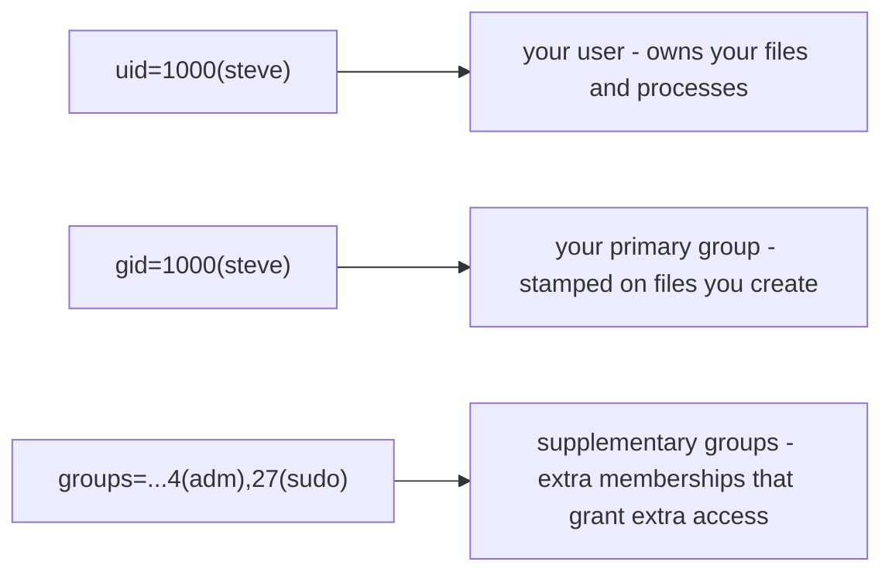

# 1 · Users, groups, and root

> **You'll learn:** to identify who you are on the system, read the user and group databases in `/etc`, and explain what makes root special.

## Why this matters

Linux was multi-user from birth: every file has an owner, every process runs *as* somebody, and every "Permission denied" you will ever see is the system comparing *who you are* with *who is allowed*. Before you can fix permission problems (next lesson), you need to know who the players are.

## The big picture

Ask the system who you are:

```console
$ id
uid=1000(steve) gid=1000(steve) groups=1000(steve),4(adm),27(sudo),100(users)
```

That one line is your entire identity:



Users and groups are just numbers (UIDs and GIDs) with names attached. The kernel only ever checks the numbers; the names are for humans.

## The user database: /etc/passwd

Every account is one line in a plain text file - go look:

```console
$ grep steve /etc/passwd
steve:x:1000:1000:Steve:/home/steve:/bin/bash
```

Seven fields, colon-separated:

| Field | Value | Meaning |
|---|---|---|
| 1 | `steve` | login name |
| 2 | `x` | password... elsewhere (see deep dive) |
| 3 | `1000` | UID - the number the kernel actually uses |
| 4 | `1000` | primary GID |
| 5 | `Steve` | comment / full name |
| 6 | `/home/steve` | home directory |
| 7 | `/bin/bash` | shell started at login |

Now `wc -l /etc/passwd` - dozens of lines. Most are **system users** (`daemon`, `www-data`, `systemd-resolve`...): accounts that exist so services can run with limited power, not so anyone can log in. The convention on Ubuntu: UIDs below 1000 are system accounts, humans start at 1000. Note their shell is often `/usr/sbin/nologin` - an account that *can't* start a shell.

## Groups: access in bulk

Groups let you grant access to a *role* instead of person by person. They live in `/etc/group`:

```console
$ grep -E '^(sudo|adm)' /etc/group
adm:x:4:steve
sudo:x:27:steve
$ groups            # your memberships, human-friendly
steve adm sudo users
```

Two kinds of membership matter:

- **Primary group** (the GID in `/etc/passwd`): stamped as group-owner on files you create. Ubuntu gives each user a private group of the same name.
- **Supplementary groups** (listed in `/etc/group`): extra keys on your keyring. `adm` lets you read logs in `/var/log`; `sudo` lets you become root (lesson 3).

> [!NOTE]
> Group changes apply at *login*. If someone adds you to a group, `groups` won't show it until you log out and back in (or start a fresh login session with `su - $USER`).

## root: UID 0

One account is special: **root**, UID 0. The kernel skips permission checks for it - root can read, write, and delete anything, kill any process, and reconfigure the system. It is the administrator account, and also the account whose typos end careers.

```console
$ head -1 /etc/passwd
root:x:0:0:root:/root:/bin/bash
```

Ubuntu ships with root's password *locked* - you cannot log in as root directly. Instead, the first user created gets the `sudo` group, and borrows root power per-command. Why that design is safer is the whole of lesson 3.

## Creating and modifying users

Ubuntu's friendly wrapper is `adduser` (interactive: creates the home directory, private group, and prompts for a password):

```console
$ sudo adduser lab          # create a user called lab
$ sudo usermod -aG adm lab  # -aG: append to a supplementary group
$ sudo deluser lab          # remove (add --remove-home to delete files too)
```

To *become* another user in your current terminal, `su` (switch user):

```console
$ su - lab                  # the "-" gives you lab's real login environment
Password:
lab@mybox:~$ id
uid=1001(lab) gid=1001(lab) groups=1001(lab)
lab@mybox:~$ exit           # back to being you
```

> [!WARNING]
> `usermod -G` (without `-a`) *replaces* the supplementary group list - people have locked themselves out of `sudo` this way. Always `-aG` when adding.

<details>
<summary>🔍 Deep dive: where passwords actually live</summary>

The `x` in `/etc/passwd` is a fossil. Passwords once really lived in field 2, but `/etc/passwd` must be world-readable (every program needs to map UIDs to names), which meant anyone could grab the hashes and crack them offline. The fix, since the 1990s: hashes moved to `/etc/shadow`, readable only by root:

```console
$ sudo head -3 /etc/shadow
root:!:19800:0:99999:7:::
daemon:*:19800:0:99999:7:::
steve:$y$j9T$...:20500:0:99999:7:::
```

`!` or `*` means the account is locked (see: root). `$y$` marks a yescrypt hash - Ubuntu's current password hashing scheme, deliberately slow to make cracking expensive. The other fields are password-aging policy - `man 5 shadow` decodes them.

</details>

## 🛠️ Try it

Map your system's population, saving answers to `~/linux-course/exercises/who-is-here.txt`:

1. From `/etc/passwd`, count the total accounts, and figure out how many are *human* (UID 1000 or above). Eyeball it with `less` or preview module 3 with `awk -F: '$3 >= 1000' /etc/passwd`.
2. Find three accounts whose shell is `nologin`. What service might each belong to?
3. List every group *you* are in, and check `/etc/group` to find one group that has members besides you (on a fresh install, try `adm` or `sudo`).
4. Create a user `lab` with `sudo adduser lab`, then `su - lab` and run `id`. Note what groups lab does *not* have compared to you.
5. Still as lab, try `less /var/log/syslog`. Then `exit`, and explain the result using lab's group list. Keep the `lab` user - the rest of the module uses it.

<details>
<summary>💡 Hint 1</summary>

Step 5: compare `id lab` with `id $USER`, then `ls -l /var/log/syslog` - look at the group owner of the file and who's in that group (`grep adm /etc/group`).

</details>

<details>
<summary>✅ Solution</summary>

```console
$ wc -l /etc/passwd                          # 1: total accounts (typically 35-50)
$ awk -F: '$3 >= 1000' /etc/passwd          # 1: humans (also catches 65534/nobody - a system account exception)
$ grep nologin /etc/passwd | head -3         # 2: e.g. daemon, www-data, systemd-network
$ groups                                     # 3
$ sudo adduser lab                           # 4
$ su - lab
$ id                                         # lab has no adm, no sudo
$ less /var/log/syslog                       # 5: Permission denied
$ exit
$ ls -l /var/log/syslog                      # group "adm" can read it; lab isn't in adm
```

lab can't read the log because syslog is readable by owner and group `adm` only, and lab isn't in `adm`. You are - that's supplementary groups doing their job.

</details>

## ✋ Checkpoint

1. Predict: a process running as `www-data` (UID 33) tries to read a file owned by `steve` that only its owner can read. What happens, and what single fact did the kernel compare?
2. Your `id` shows `groups=...27(sudo)` but a colleague swears they added you to `docker` an hour ago and `groups` doesn't show it. What's the most likely explanation?
3. Why does Ubuntu lock the root password instead of just picking a strong one at install time?
4. What's the difference in effect between `sudo usermod -aG adm lab` and `sudo usermod -G adm lab`?

<details>
<summary>Answers</summary>

1. Permission denied - the kernel compared the process's UID (33) with the file's owner UID and found no match (and no group/other access). Names never enter into it.
2. Group membership is read at login - log out and back in and `docker` will appear.
3. A locked root means no root password to guess, phish, or leak; all admin access flows through `sudo`, which is per-user, revocable, and logged (lesson 3).
4. `-aG` *adds* adm to lab's groups; `-G` *replaces* all supplementary groups with just adm, silently removing everything else.

</details>

## 📚 Further reading

- `man 5 passwd` and `man 5 group` - the exact field-by-field formats, on your machine
- [Ubuntu Server docs: user management](https://documentation.ubuntu.com/server/how-to/security/user-management/) - Ubuntu's own take on accounts and policy

---

⬅️ [Module home](README.md) · 🏠 [Course home](../README.md) · ➡️ [Next: Reading and setting permissions](02-reading-and-setting-permissions.md)
