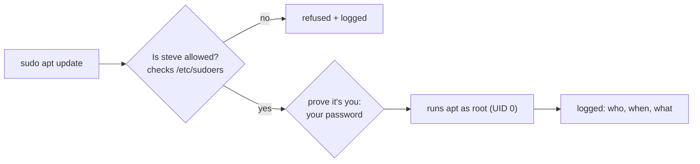

# 3 · sudo - borrowing root safely

> **You'll learn:** to use sudo deliberately - run single commands as root, check what you're allowed to do, grant someone a narrow slice of root power, and find the audit trail.

## Why this matters

Almost everything administrative - installing packages, editing `/etc`, managing services - needs root, and on Ubuntu the *only* door to root is sudo. Used well, it gives you full power with a safety net and an audit log. Used on autopilot ("just sudo it until the error goes away"), it's how systems get broken and compromised.

## The big picture

What happens when you type `sudo apt update`:



Compare the alternative - logging in as root - where every keystroke has full power, nothing is logged per-person, and there's a root password to steal. sudo means: *authenticate as yourself, act as root, one command at a time, on the record*.

On Ubuntu 26.04 the `sudo` binary is **sudo-rs**, a Rust rewrite of the 1980s original. Your muscle memory is unaffected - same command, same flags for everything this course does.

## Daily driving

```console
$ sudo apt update                # the 99% case: one command as root
[sudo] password for steve:       # YOUR password, not a root password
$ sudo -u www-data whoami        # run as a user other than root
www-data
$ sudo -l                        # what am I allowed to do here?
User steve may run the following commands on mybox:
    (ALL : ALL) ALL
$ sudo !!                        # bash trick: rerun the previous command with sudo
```

After you authenticate, sudo doesn't ask again for 15 minutes (per terminal). `sudo -k` ends that grace period early - useful before walking away.

When you genuinely need a stretch of root work, get a root shell and *leave when done*:

```console
$ sudo -i                        # login shell as root: root's environment, root's home
# apt update && apt full-upgrade
# exit
```

> [!WARNING]
> The `#` prompt means every command is running as root - no password prompts, no confirmations, no safety net. Do the job, `exit` immediately. Long-lived root shells are where "oops, wrong terminal" disasters happen.

## Who gets sudo, and how

Membership in the `sudo` group is the whole story on stock Ubuntu. The policy file `/etc/sudoers` contains this line:

```text
%sudo   ALL=(ALL:ALL) ALL
```

Reading: members of group `sudo` (`%` = group), on all hosts, may run all commands as any user and group. The installer puts the first user in that group; you grant or revoke admin rights with group membership:

```console
$ sudo usermod -aG sudo lab      # lab is now an admin (after next login)
$ sudo deluser lab sudo          # ...and now isn't
```

## Granting a slice, not the whole pie

sudoers can express much narrower grants - *this user may run exactly these commands* - and that's where its real power lies. Never edit `/etc/sudoers` directly: one syntax error locks everyone out of sudo. Use `visudo`, which syntax-checks before saving, and put local rules in a drop-in file:

```console
$ sudo visudo -f /etc/sudoers.d/lab-updates
```

```text
# lab may refresh package lists, nothing else, no password
lab ALL=(root) NOPASSWD: /usr/bin/apt update
```

Now `lab` can run `sudo apt update` - and gets refused (and logged) for anything else. This pattern is everywhere in real operations: backup users that may run one rsync, deploy users that may restart one service.

> [!TIP]
> Validate any sudoers file without risk: `sudo visudo -cf /etc/sudoers.d/lab-updates` checks syntax and reports OK or the exact error line.

## The audit trail

Every sudo invocation - allowed or refused - is logged. On 26.04 read it from the journal (module 6 goes deep):

```console
$ sudo journalctl -e SYSLOG_IDENTIFIER=sudo
jul 10 11:02:11 mybox sudo[41337]: steve : TTY=pts/0 ; PWD=/home/steve ; USER=root ; COMMAND=/usr/bin/apt update
jul 10 11:03:40 mybox sudo[41412]: lab : command not allowed ; TTY=pts/1 ; ...
```

Refusals also print the famous warning to the user - "This incident will be reported" - which lands in this log for the admins to see.

<details>
<summary>🔍 Deep dive: how sudo gets to be root at all - and why Ubuntu rewrote it in Rust</summary>

How does a program *you* start gain root? Look at it:

```console
$ ls -l /usr/bin/sudo
-rwsr-xr-x 1 root root ... /usr/bin/sudo
```

The `s` where owner-`x` should be is the **setuid bit** from lesson 2: sudo runs *as its owner, root*, no matter who launches it. All of sudo's checking (sudoers, your password) happens inside a process that is already root - the kernel's only contribution is that setuid bit.

That makes sudo the most attacked program on any Linux system: a single memory-corruption bug means anyone becomes root. It has happened - CVE-2021-3156 ("Baron Samedit") was a heap overflow in sudo's argument parsing, exploitable by any local user, latent for ten years. That class of bug is exactly what memory-safe languages prevent, and it's why Ubuntu 26.04 ships **sudo-rs**: same interface, drastically smaller and memory-safe implementation. A few obscure options of classic sudo aren't implemented; if you ever hit one, the original remains installable as `sudo-ws`.

</details>

## 🛠️ Try it

Use the `lab` user (module lessons 1-2) to practice the full grant-use-audit cycle:

1. As yourself, confirm your own powers: `sudo -l`.
2. As lab (`su - lab`), try `sudo apt update`. Read the refusal carefully.
3. Back as yourself, create `/etc/sudoers.d/lab-updates` with visudo, granting lab exactly `NOPASSWD: /usr/bin/apt update` (rule above). Validate it with `visudo -cf`.
4. As lab again: `sudo apt update` (should work, no password), then `sudo apt install cowsay` (should be refused - the grant is one command, not all of apt).
5. Find both of lab's attempts in the journal.
6. Cleanup: `sudo rm /etc/sudoers.d/lab-updates`.

<details>
<summary>💡 Hint 1</summary>

Step 2: lab isn't in the sudo group *and* has no sudoers entry yet, so the refusal is "lab is not in the sudoers file" (or "not allowed to execute"). Step 5: the journalctl command from the lesson, or `sudo journalctl -e | grep 'lab :'`.

</details>

<details>
<summary>✅ Solution</summary>

```console
$ sudo -l                                        # 1: (ALL : ALL) ALL via %sudo
$ su - lab
lab$ sudo apt update                             # 2: lab is not in the sudoers file
lab$ exit
$ sudo visudo -f /etc/sudoers.d/lab-updates      # 3: add the one-line rule
$ sudo visudo -cf /etc/sudoers.d/lab-updates
/etc/sudoers.d/lab-updates: parsed OK
$ su - lab
lab$ sudo apt update                             # 4a: runs, no password prompt
lab$ sudo apt install cowsay                     # 4b: not allowed - and logged
lab$ exit
$ sudo journalctl -e SYSLOG_IDENTIFIER=sudo      # 5: one allowed entry, one refusal
$ sudo rm /etc/sudoers.d/lab-updates             # 6
```

Note the refusal in step 4b: the sudoers match is on the exact command. `apt update` and `apt install` are different commands to sudo.

</details>

## ✋ Checkpoint

1. sudo asks for a password. Whose - yours or root's - and why is that the better design?
2. Predict: `sudo cd /root` fails with "command not found" (or an error about cd). Why can't sudo do this, given everything module 1 taught about `cd`?
3. A teammate wants to reboot a shared box but you don't want to hand out full admin. Sketch the sudoers rule.
4. Why `visudo` instead of `sudo nano /etc/sudoers`?

<details>
<summary>Answers</summary>

1. Yours. It proves the person at the keyboard is you (not someone at your unlocked screen), works per-user, and means there is no shared root password to leak or rotate.
2. `cd` is a shell *builtin*, not a program - there is no `/usr/bin/cd` for sudo to execute, and changing directory in a child process wouldn't affect your shell anyway. Use `sudo -i` and cd there.
3. `alice ALL=(root) /usr/sbin/reboot` in `/etc/sudoers.d/alice-reboot` (add `NOPASSWD:` if it should work unattended).
4. visudo syntax-checks before saving and takes a lock against concurrent edits. A syntax error saved raw to sudoers disables sudo for the whole machine - which you'd then need sudo to fix.

</details>

## 📚 Further reading

- `man sudoers` - the full policy language; search `/EXAMPLES`
- [sudo-rs on GitHub](https://github.com/trifectatechfoundation/sudo-rs) - what Ubuntu's new sudo does and doesn't implement
- [Baron Samedit advisory (CVE-2021-3156)](https://blog.qualys.com/vulnerabilities-threat-research/2021/01/26/cve-2021-3156-heap-based-buffer-overflow-in-sudo-baron-samedit) - the bug that made memory-safe sudo feel urgent

---

⬅️ [Previous: Reading and setting permissions](02-reading-and-setting-permissions.md) · 🏠 [Course home](../README.md) · ➡️ [Next: Links and inodes](04-links-and-inodes.md)
