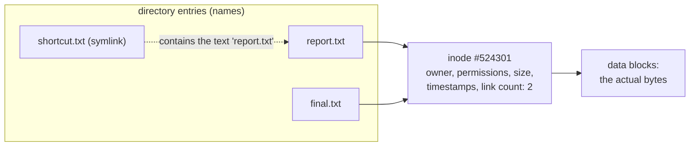

# 4 · Links and inodes - what a file really is

> **You'll learn:** what a file actually is under the hood, and how to create and read hard links and symlinks - including the link chains Ubuntu itself is built on.

## Why this matters

Ubuntu is held together with links: `/usr/bin/editor` is a link, `/etc/resolv.conf` is a link, whole commands are links to other commands. And two classic production mysteries - "I deleted the file but the disk is still full" and "the same file shows up twice in du" - are unsolvable until you know what a filename really is: not the file, just a *name pointing at* one.

## The big picture

A filename and a file are different things, connected by an **inode**:



The **inode** is the file: it holds the metadata (owner, permissions, timestamps - everything `ls -l` shows except the name) and points at the data. Directory entries just map names to inode numbers. `report.txt` and `final.txt` above are **hard links** - two equal names for one file. `shortcut.txt` is a **symlink** - a tiny file whose content is a *path*, resolved on the fly.

See inode numbers with `ls -i`, and full inode contents with `stat`:

```console
$ ls -i report.txt
524301 report.txt
$ stat report.txt        # everything the inode knows, including "Links: 2"
```

## Hard links: one file, many names

```console
$ echo "quarterly numbers" > report.txt
$ ln report.txt final.txt          # ln TARGET NEWNAME - now two names, one inode
$ ls -li report.txt final.txt
524301 -rw-rw-r-- 2 steve steve 18 Jul 10 12:01 final.txt
524301 -rw-rw-r-- 2 steve steve 18 Jul 10 12:01 report.txt
```

Same inode number, and that `2` after the permissions is the **link count** - the number of names the inode has. There is no "original": both names are the file, equally. Edit through either and both see it. Two limits: hard links can't cross filesystems (inode numbers only mean something within one), and you can't hard-link directories (it would allow loops in the tree).

That link count is also lesson 3-of-module-1's mystery solved: **`rm` doesn't delete files - it deletes names.** The kernel frees the inode and data only when the count hits zero. Which is why deleting needs `w` on the *directory* (you're editing the name table) and why `mv` within a filesystem is instant (renaming an entry, data untouched).

## Symlinks: a name that points at a name

```console
$ ln -s report.txt shortcut.txt       # -s = symbolic
$ ls -l shortcut.txt
lrwxrwxrwx 1 steve steve 10 Jul 10 12:05 shortcut.txt -> report.txt
```

Type `l`, and `ls -l` help fully shows the target. A symlink is its own tiny file containing a path; opening it transparently opens what the path leads to. Unlike hard links, symlinks happily cross filesystems, point at directories, and point at things that *don't exist yet*:

```console
$ rm report.txt                       # remove the target (final.txt still holds the data!)
$ cat shortcut.txt
cat: shortcut.txt: No such file or directory    # a dangling symlink
```

That dangling link is the symlink trade-off: it points at a name, and nobody updates it when the name goes away. `ls` colours broken links red on Ubuntu.

| | Hard link | Symlink |
|---|---|---|
| Points at | inode (the file itself) | a path (a name) |
| Target deleted | data survives - you still hold it | link dangles, opens fail |
| Cross filesystems / link dirs | no / no | yes / yes |
| Spot it with | `ls -l` link count > 1, `ls -i` | `ls -l` shows `l` and `->` |

## Ubuntu runs on symlinks

Follow a real chain on your machine:

```console
$ readlink -f /usr/bin/editor         # -f follows the whole chain to the end
/usr/bin/nano
$ ls -l /usr/bin/editor /etc/alternatives/editor
/usr/bin/editor -> /etc/alternatives/editor
/etc/alternatives/editor -> /usr/bin/nano
```

That middle hop is the **alternatives system**: generic names (`editor`, `awk`, `x-www-browser`) pointing through `/etc/alternatives`, so changing the system default is just repointing one symlink (`sudo update-alternatives --config editor`). More you already rely on:

- `/etc/resolv.conf -> ../run/systemd/resolve/stub-resolv.conf` - DNS config, live-managed by systemd (module 7)
- `/usr/bin/pager -> /etc/alternatives/pager -> /usr/bin/less`
- Many "commands" are one program with several names deciding behaviour by which name invoked it

> [!TIP]
> When any config file behaves mysteriously, `ls -l` it first. Discovering it's a symlink into `/run` or `/etc/alternatives` - regenerated by some service - explains why hand-edits keep vanishing.

<details>
<summary>🔍 Deep dive: deleted-but-still-full, the open file descriptor</summary>

The link count isn't the only thing keeping data alive: so does any process holding the file **open**. Delete a 20 GB log while the app still has it open, and `df` shows *no space reclaimed* - the name is gone, but the inode lives until the last file descriptor closes.

Find the culprits:

```console
$ sudo lsof +L1        # list open files with link count 0 - deleted but held open
```

The fix is to restart (or signal) the holding process, not to delete harder. This is also why log rotation tools either signal the app to reopen its log, or use "copytruncate". You'll meet the tooling side in modules 4 and 6.

</details>

## 🛠️ Try it

Work in `~/linux-course/exercises/links/`:

1. Create `original.txt` with a line of text. Make a hard link `hard.txt` and a symlink `soft.txt` to it. Show all three with `ls -li` and explain every difference between the lines.
2. Append a line via `hard.txt` (`echo more >> hard.txt`). Check the size of all three names. Surprised?
3. Delete `original.txt`. Predict *first* what `cat hard.txt` and `cat soft.txt` will each do - then check.
4. Repoint the broken symlink at `hard.txt` (`ln -sfn hard.txt soft.txt`) and confirm it works again.
5. Explore the real world: `readlink -f` on `/usr/bin/editor`, `/etc/resolv.conf`, and `/usr/bin/pager`. Write the full chains into `chains.txt`.
6. Finale: `ls -li /usr/bin/nano` - is *nano itself* more than one name? (Check the link count; if it's >1, find a sibling with `find /usr/bin -inum <that-inode>`.)

<details>
<summary>💡 Hint 1</summary>

Step 3: `hard.txt` shares the *inode*; `soft.txt` stored the *path* "original.txt". One of them doesn't care that the name is gone.

</details>

<details>
<summary>✅ Solution</summary>

```console
$ mkdir -p ~/linux-course/exercises/links && cd ~/linux-course/exercises/links
$ echo "the original line" > original.txt
$ ln original.txt hard.txt && ln -s original.txt soft.txt
$ ls -li            # 1: original+hard share an inode, count 2; soft is type l, size = path length
$ echo more >> hard.txt
$ ls -l             # 2: original.txt and hard.txt both grew - same file. soft.txt unchanged (it's just a path)
$ rm original.txt
$ cat hard.txt      # 3: works perfectly - the inode still has one name
$ cat soft.txt      # 3: No such file or directory - dangling
$ ln -sfn hard.txt soft.txt && cat soft.txt   # 4: alive again
$ readlink -f /usr/bin/editor /etc/resolv.conf /usr/bin/pager > chains.txt   # 5
$ ls -li /usr/bin/nano                        # 6: often link count 2...
$ find /usr/bin -inum $(stat -c %i /usr/bin/nano)   # ...its sibling name (rnano on many installs)
```

</details>

## ✋ Checkpoint

1. `ls -l` shows `-rw-r--r-- 3 root root ...` for a file. What does the `3` tell you, and how would you find the other names on the same filesystem?
2. Predict: `ln -s /tmp/a /tmp/b`, then `echo hi > /tmp/a`, then `rm /tmp/a`, then `echo again > /tmp/b`. Does the last command fail - and if not, what now exists?
3. Your hand-edit to `/etc/resolv.conf` is gone after reboot. Using this lesson, what almost certainly happened?
4. Why does `mv` on a 50 GB file take 0.1 s within one disk but minutes to a USB stick? (Module 1 promised this answer.)

<details>
<summary>Answers</summary>

1. The inode has 3 names (hard links). `find / -xdev -inum $(stat -c %i thefile)` lists them.
2. It succeeds - writing *through* a symlink creates the target if the directory allows it. `/tmp/a` exists again containing "again", and `/tmp/b` still points at it. Symlinks resolve at every use, not at creation.
3. It's a symlink into `/run/systemd/...`, regenerated by systemd-resolved; your edit went to a managed file (or replaced the link) and the manager won. Configure the service, not the symlink.
4. Within one filesystem `mv` renames a directory entry - the data never moves. Across filesystems inode numbers don't transfer, so `mv` must copy every byte and then delete the original.

</details>

## 📚 Further reading

- `man 7 inode` - the inode's full contents, straight from the kernel docs
- [update-alternatives](https://manpages.ubuntu.com/manpages/resolute/en/man1/update-alternatives.1.html) - Ubuntu's symlink-powered defaults system

---

⬅️ [Previous: sudo - borrowing root safely](03-sudo-borrowing-root-safely.md) · 🏠 [Course home](../README.md) · ➡️ Next module: [Shell Power Tools](../module-03-shell-power-tools/README.md)
