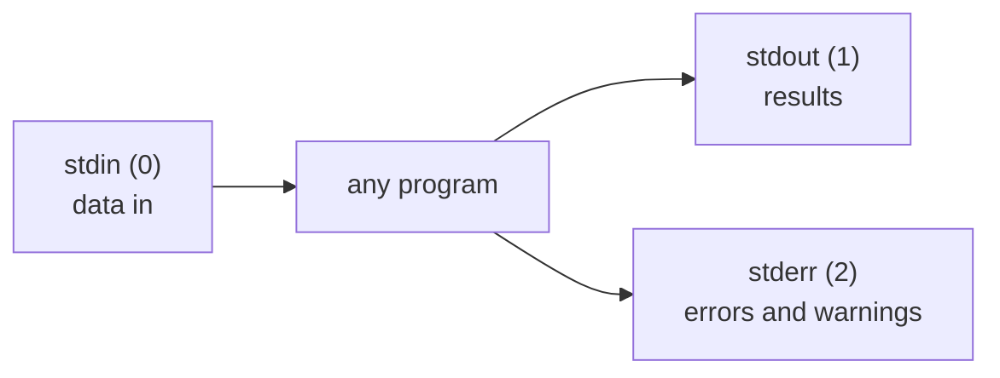

# 1 · Pipes and redirection

> **You'll learn:** to route the output of any command into files, into other commands, or into the void - and to chain small tools into one-liners that answer real questions.

## Why this matters

The command line's superpower is not any single command - it's that commands *compose*. "How many users have a real shell?" is not a program anyone wrote; it's three small programs snapped together in five seconds. Pipes and redirection are the connectors, and every module after this one assumes you can wield them.

## The big picture

Every program is born with three data streams attached:



By default all three connect to your terminal. Redirection and pipes re-plug them:

```console
$ ls -l > listing.txt        # stdout → file (create/overwrite)
$ ls -l >> listing.txt       # stdout → file (append)
$ ls /nope 2> errors.txt     # stderr → file
$ sort < names.txt           # file → stdin
$ ls /usr/bin | wc -l        # stdout of ls → stdin of wc: a pipe
```

That last one is the big idea: `|` connects programs directly, no intermediate file, and any number can chain.

## The three streams

Why *two* output streams? So results stay clean even when things go wrong. Watch them separate:

```console
$ ls /etc/hostname /nope
ls: cannot access '/nope': No such file or directory   # ← stderr
/etc/hostname                                          # ← stdout
$ ls /etc/hostname /nope > out.txt
ls: cannot access '/nope': No such file or directory   # error still hits the terminal
$ cat out.txt
/etc/hostname                                          # only results were captured
```

The numbers in the diagram are real: streams are numbered **file descriptors** - 0, 1, 2. `2>` means "redirect descriptor 2". The full toolbox:

| Syntax | Effect |
|---|---|
| `> f` / `>> f` | stdout to f: overwrite / append |
| `2> f` | stderr to f |
| `2>&1` | stderr to wherever stdout currently points |
| `> f 2>&1` or `&> f` | both streams to f |
| `2> /dev/null` | discard errors (`/dev/null` swallows everything) |
| `< f` | f becomes stdin |

```console
$ find / -name "*.conf" 2> /dev/null     # the classic: hunt system-wide, mute the Permission denied noise
```

> [!WARNING]
> `>` truncates the file *before* the command runs. `sort data.txt > data.txt` destroys data.txt - it's emptied first, then sorted. Write to a new file, or use `sort -o data.txt data.txt`.

## Pipes: composing programs

A pipe hands one command's stdout to the next command's stdin. Small tools, each doing one job, become an assembly line:

```console
$ grep bash /etc/passwd | wc -l                # how many accounts use bash?
$ ls -S /var/log | head -3                     # three biggest files in /var/log
$ history | grep ssh | tail -5                 # my last 5 ssh-related commands
$ du -sh /var/* 2>/dev/null | sort -rh | head  # what's eating /var? (preview of lesson 3)
```

This is the **Unix philosophy** in one sentence: each program does one thing, speaks plain text, and expects to be glued to others. `wc` doesn't know about passwd files; `grep` doesn't know about counting. Composition does the knowing.

Sometimes you want to watch *and* capture - `tee` splits the stream:

```console
$ make 2>&1 | tee build.log     # see the build live AND keep a log
```

## Exit status: did it work?

Every command reports success (0) or failure (non-zero) invisibly. The shell keeps the last one in `$?`, and `&&` / `||` act on it:

```console
$ grep -q steve /etc/passwd; echo $?     # 0: found (-q = quiet, just the status)
$ grep -q zorp  /etc/passwd; echo $?     # 1: not found
$ sudo apt update && echo "refreshed"    # && : run only if the left side succeeded
$ grep -q lab /etc/passwd || echo "no lab user"   # || : run only if it failed
```

These become the bones of every script in lesson 5.

<details>
<summary>🔍 Deep dive: a pipe is a kernel object, and the pipeline runs in parallel</summary>

`cmd1 | cmd2` doesn't run cmd1 to completion and then feed cmd2. The shell starts **both processes at once**, connected by a small in-kernel buffer (64 KB by default). cmd1 blocks when the buffer is full, cmd2 blocks when it's empty - the kernel's scheduling does the rest. Consequences you can observe:

- `tail -f /var/log/syslog | grep error` works on an *infinite* stream - grep prints matches as they arrive, forever.
- A huge pipeline uses almost no memory or disk: data flows through in 64 KB sips.
- `yes | head -3` terminates even though `yes` never does: when `head` exits, the pipe breaks and the kernel kills `yes` with SIGPIPE (module 4's territory).

`ls -l /proc/self/fd` shows your shell's descriptors 0, 1, 2 live - pointing at the same pseudo-terminal from module 1's deep dive.

</details>

## 🛠️ Try it

Answer with pipelines, saving each winning one-liner into `~/linux-course/exercises/pipelines.txt`:

1. How many commands live in `/usr/bin`? (module 1 preview, now yours for real)
2. Create `shells.txt` containing the accounts from `/etc/passwd` that use bash - then *append* the ones using `nologin`. Two redirect flavours, one file.
3. How many *unique* shells are in use? Chain: something | something | `wc -l` (peek: `cut -d: -f7 /etc/passwd | sort -u`).
4. Run `find /etc -name "*.conf"` as yourself: results to `confs.txt`, permission errors to `errs.txt`, in one command. Then count each.
5. Write a one-liner that prints "syslog is big" only if `/var/log/syslog` is over 10 MB (hint: `find /var/log -name syslog -size +10M` prints a match; `grep -q .` or `&&` finish the job).

<details>
<summary>💡 Hint 1</summary>

Step 4: two redirections in one command: `find ... > confs.txt 2> errs.txt`. Step 5: `find ... -size +10M | grep -q . && echo "syslog is big"` - grep -q succeeds only if *something* came through the pipe.

</details>

<details>
<summary>✅ Solution</summary>

```console
$ ls /usr/bin | wc -l                                    # 1
$ grep bash /etc/passwd > shells.txt                     # 2: create
$ grep nologin /etc/passwd >> shells.txt                 # 2: append
$ cut -d: -f7 /etc/passwd | sort -u | wc -l              # 3: typically 4-6
$ find /etc -name "*.conf" > confs.txt 2> errs.txt       # 4
$ wc -l confs.txt errs.txt
$ find /var/log -name syslog -size +10M | grep -q . && echo "syslog is big"   # 5
```

</details>

## ✋ Checkpoint

1. Predict the contents of `out.txt`: `echo one > out.txt; echo two > out.txt; echo three >> out.txt`
2. Your backup script's cron email is full of "Permission denied" noise drowning the real summary. Which stream do you redirect, and where?
3. Why does `sort huge.txt > huge.txt` destroy the file, while `sort huge.txt | tee huge.txt` is *also* unsafe but `sort -o huge.txt huge.txt` is fine?
4. Predict: `false && echo A || echo B` prints what? (`false` is a command that always fails.)

<details>
<summary>Answers</summary>

1. `two` then `three` - the second `>` truncated and replaced "one"; `>>` appended.
2. stderr, to `/dev/null` (or a log file): `backup.sh 2>/dev/null` keeps stdout's summary clean.
3. `>` truncates before sort ever reads; tee also starts writing while sort reads (race). `sort -o` is safe because sort reads *all* input before opening the output - the tool handles the ordering itself.
4. `B` - false fails, so `&&` skips A; the overall status is still failure, so `||` runs B.

</details>

## 📚 Further reading

- `man bash`, section REDIRECTION - the complete (and surprisingly deep) rulebook
- [The Art of Unix Programming, ch. 1](http://www.catb.org/~esr/writings/taoup/html/ch01s06.html) - the Unix philosophy from someone who was there

---

⬅️ [Module home](README.md) · 🗺️ [Course map](../README.md) · ➡️ [Next: grep and find](02-grep-and-find.md)
