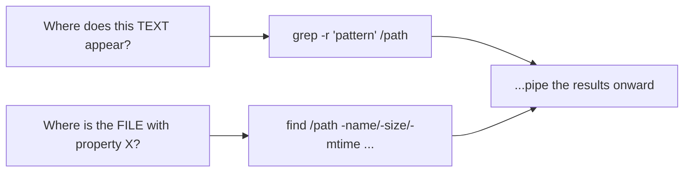

# 2 · grep and find

> **You'll learn:** to find any text in any file with grep, and any file on the system with find - the two searches that answer "where is it?" forever.

## Why this matters

"Which config file mentions this port?" "Where did that error come from?" "What's been modified since yesterday?" Investigation on Linux is these two tools. grep searches *inside* files; find searches *for* files. Between them and a pipe, very little stays hidden.

## The big picture



```console
$ grep -rn "PermitRootLogin" /etc/ssh/        # every mention, with file and line number
/etc/ssh/sshd_config:33:#PermitRootLogin prohibit-password
$ find /var/log -name "*.gz" -mtime -7        # .gz files changed in the last 7 days
```

## grep: searching inside files

`grep PATTERN FILES` prints every matching line. The flags you'll actually use:

| Flag | Effect |
|---|---|
| `-i` | ignore case |
| `-r` | recurse into a directory |
| `-n` | show line numbers |
| `-v` | invert: lines that do NOT match |
| `-c` | count matches instead of printing |
| `-l` | just list the files that match |
| `-w` | whole words only (`-w log` won't match "login") |
| `-A3` / `-B3` / `-C3` | 3 lines of context After / Before / around each match |

```console
$ grep -i error /var/log/dpkg.log             # case-insensitive
$ grep -rl "127.0.0.1" /etc 2>/dev/null       # which /etc files mention localhost?
$ grep -v '^#' /etc/ssh/sshd_config | grep -v '^$'   # a config, minus comments and blanks
```

That last pipeline - "show me the config without the noise" - you will use weekly for the rest of your career.

## Patterns: a first taste of regex

grep patterns are **regular expressions** - a tiny language for describing text shapes:

| Pattern | Matches |
|---|---|
| `^Port` | "Port" at the start of a line |
| `bash$` | "bash" at the end of a line |
| `.` | any single character |
| `[0-9]` / `[aeiou]` | one character from the set |
| `error\|warn` | either word (with `grep -E`, just `error|warn`) |
| `ssh.*password` | "ssh", anything, then "password" - on one line |

```console
$ grep -E '^(steve|lab):' /etc/passwd          # lines starting with either name + colon
$ grep -E ':[0-9]{4}:' /etc/passwd             # a 4-digit field - UIDs 1000+
```

> [!TIP]
> Regex `.` and `*` are NOT glob `?` and `*` from module 1. Glob `*.txt` = regex `.*\.txt`. The shell expands globs before grep runs, which is why patterns belong in quotes: `grep 'a*b' file`, not `grep a*b file`.

## find: searching for files

`find WHERE TESTS` walks a directory tree and prints what passes the tests. Tests combine (AND by default):

```console
$ find ~ -name "*.txt"                        # by name (glob syntax, quoted!)
$ find /etc -type d -name "ssh*"              # directories only
$ find /var/log -size +50M                    # bigger than 50 MB
$ find ~ -mtime -1                            # modified in the last 24 hours
$ find /etc -newer /etc/hostname              # modified more recently than that file
$ find / -user lab 2>/dev/null                # owned by lab, noise muted (lesson 1!)
$ find ~ -type f -perm -o+w                   # world-writable files - a security sweep
```

| Test | Meaning |
|---|---|
| `-name` / `-iname` | name matches glob (case-sensitive / not) |
| `-type f` / `-type d` / `-type l` | file / directory / symlink |
| `-size +50M` / `-size -1k` | bigger / smaller than |
| `-mtime -7` / `-mmin -30` | modified within 7 days / 30 minutes |
| `-user`, `-group`, `-perm` | ownership and permissions (module 2 pays off) |
| `-maxdepth 2` | don't descend deeper than 2 levels |

## Acting on what you find

find can *do* things to matches, not just print them:

```console
$ find ~/linux-course -name "*.tmp" -delete           # careful - test with plain print first!
$ find /etc -name "*.conf" -exec grep -l "Port" {} \;  # run grep on each match
$ find ~ -name "*.log" -print0 | xargs -0 wc -l        # or hand the list to xargs, batched
```

`{}` is the found file, `\;` ends the command. `xargs` achieves the same by building big command lines from stdin - the `-print0`/`-0` pair keeps filenames with spaces intact.

> [!WARNING]
> Always run the bare `find` (printing only) and eyeball the list *before* adding `-delete` or `-exec rm`. `-delete` respects no trash can, and a mistyped test deletes the wrong tree. Same habit as `echo *.txt` before `rm *.txt` in module 1.

<details>
<summary>🔍 Deep dive: grep -r vs. find + grep - and when each wins</summary>

`grep -r pattern /dir` and `find /dir -type f -exec grep pattern {} +` reach similar ends. grep -r is shorter and fast for "search everything here". find + grep wins when you want to *pre-filter which files to search*: only `.conf` files, only files under 1 MB, only files changed this week - find selects, grep searches.

Real-world note: on code repositories, developers mostly use `ripgrep` (`rg`, `apt install ripgrep`) - a modern Rust grep that skips `.git` and binary files by default and is dramatically faster on big trees. The pattern language and habits transfer directly. (A theme by now: your `ls` is Rust, your `sudo` is Rust, and the fastest grep is too.)

</details>

## 🛠️ Try it

An investigation sweep - save the winning commands to `~/linux-course/exercises/searching.txt`:

1. Which files under `/etc/ssh` mention "Port" - names only? Then show the actual lines *with* line numbers, comments excluded.
2. Show `/etc/login.defs` with all comments and blank lines stripped. How many real directives remain?
3. Find the 3 largest files under `/var/log` (find by size + `ls -lhS`, or pure find; either counts).
4. What changed on the system in the last 10 minutes? Search `/etc` and `/var/log` with `-mmin`, errors muted.
5. Count lines of "real" content across every `.conf` file in `/etc/systemd`: find them, hand them to `xargs wc -l`, read the total.
6. Security mini-audit: any world-writable *regular files* under your home? (There should be none - if you find some, module 2 tells you what to do.)

<details>
<summary>💡 Hint 1</summary>

Step 1: `grep -l` then `grep -n` piped through `grep -v '^#'`. Step 4: `find /etc /var/log -mmin -10 2>/dev/null` - find takes multiple start points.

</details>

<details>
<summary>✅ Solution</summary>

```console
$ grep -rl Port /etc/ssh                                      # 1a
$ grep -rn Port /etc/ssh | grep -v '#'                        # 1b (good enough; stricter: ':#' anchoring)
$ grep -vE '^#|^$' /etc/login.defs | wc -l                    # 2: ~30-40 directives
$ find /var/log -type f -size +1M 2>/dev/null | head -3       # 3, or:
$ ls -lhS /var/log 2>/dev/null | head -4
$ find /etc /var/log -mmin -10 2>/dev/null                    # 4: logs churn constantly - that's normal
$ find /etc/systemd -name "*.conf" -print0 | xargs -0 wc -l | tail -1   # 5: the "total" line
$ find ~ -type f -perm -o+w                                   # 6: silence is the right answer
```

</details>

## ✋ Checkpoint

1. Predict the difference: `grep -c error app.log` vs `grep error app.log | wc -l` - same number always?
2. You need every file under `/home` larger than 100 MB that nobody has touched in a year, as candidates for cleanup. Write the find.
3. Why does `find / -name *.conf` (unquoted) sometimes error with "paths must precede expression" - what did the shell do to you? (Module 1 knows.)
4. Which tool and flags: "list the files in /etc/nginx that do NOT contain the word ssl"?

<details>
<summary>Answers</summary>

1. Same in practice (both count matching lines). Subtle difference: `-c` counts lines with at least one match per *file*; with multiple files it prints one count each, where `wc -l` gives one grand total.
2. `find /home -type f -size +100M -mtime +365` (add `2>/dev/null` when run as non-root).
3. The shell glob-expanded `*.conf` against files in the *current directory* before find ran, so find received several filenames where one pattern should be. Quote it: `-name "*.conf"`.
4. `grep -rL ssl /etc/nginx` - capital `-L` is the files-that-do-NOT-match twin of `-l`.

</details>

## 📚 Further reading

- `man grep` - the regex section is a fine first regex course
- `man find` - skim OPERATORS and EXAMPLES; find is deeper than any cheat sheet
- [regex101.com](https://regex101.com/) - interactive regex testing when a pattern fights back

---

⬅️ [Previous: Pipes and redirection](01-pipes-and-redirection.md) · 🏠 [Course home](../README.md) · ➡️ [Next: Text surgery](03-text-surgery.md)
