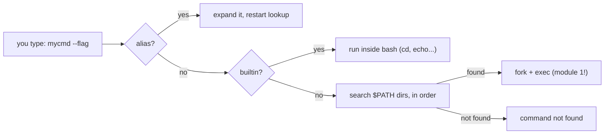

# 4 · The shell as a home

> **You'll learn:** how the shell finds commands and remembers settings - variables, $PATH, .bashrc, aliases, and the history tricks that double your speed.

## Why this matters

You'll spend thousands of hours in this program; it's worth knowing how it thinks and making it yours. And practically: "command not found" for something you *just installed*, settings that vanish when you open a new terminal, scripts that work for you but not for cron - all of these are $PATH and startup-file problems, and they stop happening once you see the machinery.

## The big picture

The shell is a state machine you can inspect and configure:



Aliases beat builtins beat $PATH - and `type mycmd` (module 1's friend) tells you which one won.

## Variables: shell vs environment

The shell holds named values. Plain **shell variables** are private scratch space; **exported** ones join the *environment*, which every child process inherits:

```console
$ course="linux"              # shell variable (no spaces around = !)
$ echo "module 3 of $course"
module 3 of linux
$ export EDITOR=nano          # environment variable - children see it too
$ printenv | head -5          # the environment you're passing to every command
$ echo $HOME $USER $SHELL     # the famous ones are just... variables
```

Why it matters: programs read the environment for configuration. `git` opens `$EDITOR` for commit messages, `man` uses `$PAGER`, and sudo, cron, and ssh each build *different* environments - which is why "works in my terminal" sometimes doesn't elsewhere.

Two conventions: UPPERCASE for exported/environment variables, lowercase for your shell-local ones.

## $PATH: how commands are found

`$PATH` is a colon-separated list of directories, searched left to right:

```console
$ echo $PATH
/usr/local/sbin:/usr/local/bin:/usr/sbin:/usr/bin:/sbin:/bin:...
$ type -a python3             # where would it come from? in order:
python3 is /usr/bin/python3
```

"Command not found" means: not an alias, not a builtin, and in *none of those directories*. The standard personal fix - a `~/bin` (or `~/.local/bin`) for your own scripts:

```console
$ mkdir -p ~/bin
$ export PATH="$HOME/bin:$PATH"     # prepend: yours win name clashes
```

Ubuntu's default `~/.profile` actually adds `~/bin` and `~/.local/bin` automatically *if they exist* - create the directory, log in again, done.

> [!WARNING]
> Never put `.` (the current directory) in $PATH. On a multi-user box, `cd /tmp` + typo = running whatever program an attacker left there named `sl` or `gti`. It's also why running your own script requires the explicit `./myscript.sh`.

## .bashrc: making it stick

Everything above dies with the terminal. Persistence lives in startup files in your home directory:

| File | Read when | Put here |
|---|---|---|
| `~/.bashrc` | every *interactive* shell (each new terminal) | aliases, prompt, shell options, interactive $PATH tweaks |
| `~/.profile` | *login* shells (console/ssh login; sources .bashrc on Ubuntu) | environment variables, $PATH - things children should inherit |

Rule of thumb that keeps Ubuntu users out of trouble: **aliases and interactive candy in `.bashrc`, environment in `.profile`** - and when in doubt, `.bashrc` works because Ubuntu wires them together. After editing, reload without reopening the terminal:

```console
$ source ~/.bashrc            # or the shorthand:  . ~/.bashrc
```

## Aliases: your own vocabulary

An alias is simple text substitution for the first word of a command:

```console
$ alias ll='ls -alF'          # Ubuntu ships this one in .bashrc already
$ alias gs='git status'
$ alias please='sudo'
$ alias                        # list them all
$ unalias please
$ \ls                          # backslash bypasses an alias one time
```

Ubuntu's default `.bashrc` also aliases `grep` to `grep --color=auto` - you've been using aliases all course. When an alias needs arguments in the *middle* or any logic at all, it wants to be a function or a script (next lesson).

## History: never type twice

bash records your commands (`~/.bash_history`, ~1000-2000 by default). The recall toolkit:

| Keys / syntax | Does |
|---|---|
| `Ctrl+R` then type | **reverse search** - the single biggest speed upgrade in this course. Ctrl+R again for older hits, Enter to run, Esc to edit first |
| `!!` | the previous command (`sudo !!` - forgot sudo again) |
| `!$` | last argument of the previous command (`mkdir deep/path` then `cd !$`) |
| `Alt+.` | paste last argument, press again to cycle back through history |
| `history \| grep ssh` | it's just text - lesson 2 applies |

And the line-editing keys that make Ctrl+R worth it: `Ctrl+A`/`Ctrl+E` start/end of line, `Ctrl+W` delete word back, `Ctrl+U` wipe the line, `Ctrl+L` clear screen.

<details>
<summary>🔍 Deep dive: login vs interactive shells - why .bashrc sometimes doesn't run</summary>

bash picks startup files by *how it was started*:

- **Interactive login** (ssh in, console login): reads `/etc/profile`, then the first of `~/.bash_profile` / `~/.bash_login` / `~/.profile`. Ubuntu's `~/.profile` ends by sourcing `~/.bashrc` - that's the wiring.
- **Interactive non-login** (a new terminal window under GNOME): reads `~/.bashrc` directly.
- **Non-interactive** (a script, cron, `ssh host command`): reads *almost nothing*. Your aliases and $PATH additions do not exist there.

That third case explains a whole genre of mystery: "my script works when I run it, but fails in cron" - cron's environment is nearly empty (PATH is typically just `/usr/bin:/bin`). The fix is never "source my .bashrc from cron"; it's making the script self-sufficient with absolute paths or its own PATH line - which is lesson 5's business.

</details>

## 🛠️ Try it

Renovate your shell - this exercise's deliverable is your actual environment:

1. Create `~/bin`, and check with `grep -n 'bin' ~/.profile` that Ubuntu's stanza will pick it up. Add it to the *current* session's $PATH by hand, and prove ordering with `echo $PATH`.
2. Put a first command in it: `printf '#!/bin/bash\necho hello from my own command\n' > ~/bin/hello && chmod +x ~/bin/hello`. Run `hello` from any directory. Confirm with `type hello`.
3. Add three aliases to `~/.bashrc` (suggestions: `ll` variants you actually like, `ports='ss -tlnp'`, `week='date +%V'`), reload with `source ~/.bashrc`, test them, and check `type ll` reports the alias.
4. Set `EDITOR` to your preference in the right file for inheritance, reload, and verify a child process sees it: `bash -c 'echo $EDITOR'`.
5. History drills, 2 minutes: recall your module-2 `visudo` command with `Ctrl+R`; run `mkdir -p /tmp/deep/nested/dir` then reach it with `cd` + `Alt+.`; run any command, then re-run it with `!!`.

<details>
<summary>💡 Hint 1</summary>

Step 4: `export EDITOR=nano` belongs in `~/.profile` (inheritance = environment = profile), but you must `source ~/.profile` or re-login for it to take effect. The `bash -c` check proves the *export* happened - a plain (unexported) variable would print empty.

</details>

<details>
<summary>✅ Solution</summary>

```console
$ mkdir -p ~/bin && export PATH="$HOME/bin:$PATH"       # 1
$ echo $PATH | cut -d: -f1                              # /home/steve/bin - first, so it wins
$ printf '#!/bin/bash\necho hello from my own command\n' > ~/bin/hello
$ chmod +x ~/bin/hello && hello                          # 2
hello from my own command
$ type hello
hello is /home/steve/bin/hello
$ echo "alias ports='ss -tlnp'" >> ~/.bashrc            # 3 (plus your other two)
$ source ~/.bashrc && ports && type ports
$ echo 'export EDITOR=nano' >> ~/.profile               # 4
$ source ~/.profile && bash -c 'echo $EDITOR'
nano
```

Step 5 leaves no transcript - if `cd` + `Alt+.` landed you in `/tmp/deep/nested/dir`, you passed.

</details>

## ✋ Checkpoint

1. Predict: `x=5; bash -c 'echo $x'` prints what? And after `export x=5`?
2. A teammate's prompt is broken and every command says "command not found" - even `ls`. Their last change: editing PATH in .bashrc. What probably happened, and why does `/usr/bin/ls` still work?
3. You installed a tool with `pip install --user`, it went to `~/.local/bin/toolname`, and `toolname` says command not found - but works after you log out and in. Explain, using this lesson.
4. Where do these belong, .bashrc or .profile: (a) `alias k=kubectl`, (b) `export GOPATH=~/go`, (c) a custom prompt?

<details>
<summary>Answers</summary>

1. Empty - `x` was never exported, so the child bash never saw it. With `export x=5`: prints 5.
2. They *replaced* PATH instead of prepending (`PATH="$HOME/bin"` instead of `PATH="$HOME/bin:$PATH"`), so the standard directories vanished from the search. Absolute paths bypass PATH entirely - the programs were never gone, only unfindable.
3. Ubuntu's `~/.profile` only adds `~/.local/bin` to PATH *if the directory exists* - and it's read at login. The directory was created after your last login, so PATH gained it on the next one. `source ~/.profile` would have done it immediately.
4. (a) .bashrc - aliases are interactive-only anyway. (b) .profile - environment for all children. (c) .bashrc - the prompt only exists interactively.

</details>

## 📚 Further reading

- `man bash` sections ALIASES, HISTORY EXPANSION, and INVOCATION - the last one settles every startup-file argument
- [Ubuntu's default dotfiles in /etc/skel](https://manpages.ubuntu.com/manpages/resolute/en/man5/adduser.conf.5.html) - `ls -a /etc/skel` shows exactly what every new user starts with, and diffing against yours shows what you've changed

---

⬅️ [Previous: Text surgery](03-text-surgery.md) · 🗺️ [Course map](../README.md) · ➡️ [Next: Your first shell scripts](05-your-first-shell-scripts.md)
