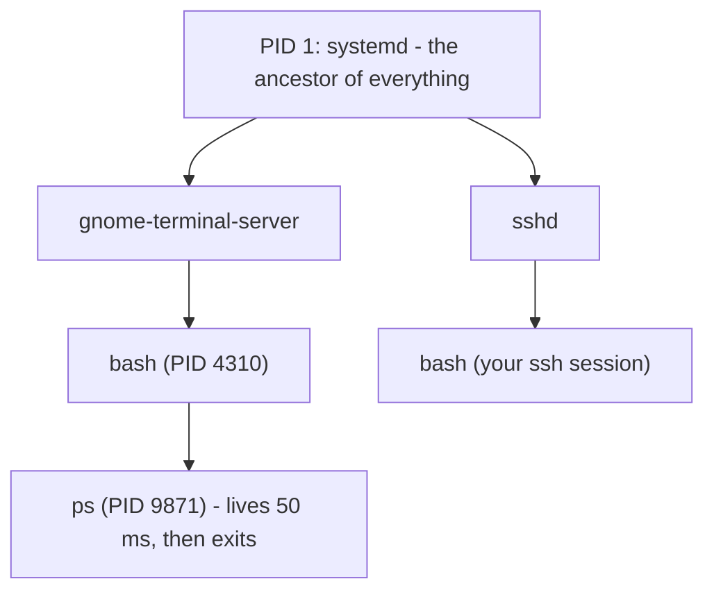

# 1 · What a process is

> **You'll learn:** to see everything running on your machine as one family tree of processes, and read ps, top, and free to answer "what is this box doing right now?"

## Why this matters

Every running program - your shell, this terminal, the web server, the thing eating 100% CPU - is a **process**, and they are all related. "Why is the fan screaming", "why is it slow", "what even started this?" are all answered by looking at the process table, and doing that is the first move of every performance investigation you'll ever run.

## The big picture

Ask for your own ancestry:

```console
$ ps -o pid,ppid,user,cmd
    PID    PPID USER     CMD
   4310    4302 steve    bash
   9871    4310 steve    ps -o pid,ppid,user,cmd
```

Every process has a **PID** (its number) and a **PPID** - its *parent's* PID, because every process is created by another one (module 1's fork/exec deep dive, now visible). Follow the parents up and you always arrive at PID 1:



One tree, rooted at systemd, holding everything alive on the machine. `pstree -p` draws yours.

## ps: photographing the process table

`ps` is a snapshot. Two dialects survive from Unix history; learn one of each:

```console
$ ps aux                        # BSD style: every process, with %CPU and %MEM
$ ps -ef                        # System V style: every process, with PPID
$ ps aux | grep firefox         # module 3 reflexes apply - it's just text
$ ps -o pid,ppid,stat,cmd -u lab    # choose your columns, filter by user
$ echo $$                       # bash's own PID lives in $$
```

Reading `ps aux` columns: `%CPU`/`%MEM` (share of a core / of RAM), `STAT` (state - below), `START`, `TIME` (CPU time actually consumed - a process can be old and have used 2 seconds), `COMMAND`.

The STAT letter is a process's vital sign:

| State | Meaning | Worry? |
|---|---|---|
| `R` | running (or ready to run) | it's using CPU |
| `S` | sleeping - waiting for something (input, network, a timer) | no - most of the table is S |
| `D` | uninterruptible sleep - stuck in the kernel, usually disk/NFS I/O | yes, if it stays D |
| `T` | stopped (paused - lesson 2 does this on purpose) | you did it |
| `Z` | zombie - dead, waiting for its parent to collect the exit status | see deep dive |

## top: the live view

`top` is ps refreshed every 3 seconds - but its *header* is the real briefing:

```text
top - 12:04:01 up 9 days,  3:11,  1 user,  load average: 0.42, 0.31, 0.24
Tasks: 312 total,   1 running, 311 sleeping,   0 stopped,   0 zombie
MiB Mem :  15734.2 total,   1201.5 free,   6110.0 used,   9422.7 buff/cache
```

**Load average** - the three numbers everyone quotes - is the average count of processes running-or-waiting (R, plus D) over the last 1, 5, and 15 minutes. The scale is your CPU count: load 4.0 on a 4-core box (check with `nproc`) means fully busy; 8.0 means work is queueing; 0.42 means mostly idle. Three numbers give you the *trend*: 6.0, 2.0, 0.5 reads "spike happening now"; 0.5, 2.0, 6.0 reads "recovering from one".

Inside top, keys beat flags: `M` sorts by memory, `P` by CPU, `k` kills (lesson 2), `1` shows per-core, `q` quits. Install `htop` (`sudo apt install htop`) for the same data with colours, scrolling, and a tree view - most admins live in it.

## free: where the memory went

```console
$ free -h
               total        used        free      shared  buff/cache   available
Mem:            15Gi       6.0Gi       1.2Gi       410Mi       9.2Gi       9.0Gi
Swap:           4.0Gi       256Mi       3.7Gi
```

The number that matters is **available**, not free. Linux deliberately fills idle RAM with disk cache (`buff/cache`) because empty memory is wasted memory - and hands it back instantly when programs need it. "My server has almost no free RAM" is, by itself, a healthy sign. Worry when *available* is low and swap is *growing*.

<details>
<summary>🔍 Deep dive: zombies and orphans</summary>

When a process exits, its exit status must be *collected* by its parent (the `wait` syscall). Until then a husk stays in the process table: state `Z`, a **zombie**. Zombies use no CPU or memory - a few are normal and momentary. A *growing herd* of them means a buggy parent that never collects; the fix is fixing (or killing) the parent, not the zombies - you cannot kill what is already dead.

The reverse case: a parent dies *before* its child. The child is an **orphan**, and the kernel re-parents it to PID 1, which dutifully collects exit statuses forever. That re-parenting trick is also how daemons traditionally detached themselves from terminals - and lesson 2's `nohup`/`disown` relies on the same mechanics.

</details>

## 🛠️ Try it

Answers into `~/linux-course/exercises/processes.txt`:

1. Draw your own lineage: `echo $$`, then use repeated `ps -o ppid= -p <PID>` hops (or one `pstree -sp $$`) to walk from your shell to PID 1. Write the chain down.
2. Census: how many processes total? How many are *yours*? How many are in state S? (`ps aux` + module 3 - `wc`, `awk`, or `grep -c` all work.)
3. Find the top 3 memory eaters two ways: in `top` (the `M` key) and as a pipeline (`ps aux --sort=-%mem | head -4`).
4. Open a second terminal, run `sleep 500` in it, and from your *first* terminal find its PID, its parent, and its state. Predict the state before you look.
5. Read your load average from `uptime`, read `nproc`, and write one sentence interpreting the numbers on your machine.
6. Bonus zombie hunt: check `top`'s Tasks line for any zombies, and try `ps aux | grep defunc[t]` (zombies show as `<defunct>`). A healthy desktop usually has zero - knowing how you'd *look* is the point.

<details>
<summary>💡 Hint 1</summary>

Step 4: `pgrep -a sleep` finds it fast (full pgrep treatment next lesson - `ps aux | grep sleep` also fine). A sleeping sleep is, fittingly, `S`.

</details>

<details>
<summary>✅ Solution</summary>

```console
$ pstree -sp $$                                   # 1: e.g. systemd(1)───...───bash(4310)───pstree(9944)
$ ps aux | tail -n +2 | wc -l                     # 2: total (tail skips the header)
$ ps aux | awk -v me="$USER" '$1==me' | wc -l     # 2: yours
$ ps aux | awk '$8 ~ /^S/' | wc -l                # 2: sleepers (S, Ss, Sl...)
$ ps aux --sort=-%mem | head -4                   # 3
$ pgrep -a sleep                                  # 4: PID + command
$ ps -o pid,ppid,stat,cmd -p <thatPID>            # 4: STAT S, PPID = the other bash
$ uptime && nproc                                 # 5: "load 0.31 on 8 cores = ~4% busy"
```

</details>

## ✋ Checkpoint

1. Predict: you run `ps aux | grep firefox` and firefox is *not* running. How many lines come back, and why that many?
2. A 4-core server shows load average `8.1, 7.9, 8.2`. One sentence: what's happening, and is it getting better?
3. `free -h` shows 200 MB free of 16 GB. The intern wants to reboot. What column do you check first, and what do you tell them if it says 9 GB?
4. Process 4410 is state `Z` and has been for an hour. Why does `kill 4410` achieve nothing, and what actually clears it?

<details>
<summary>Answers</summary>

1. One line - the `grep firefox` process itself, whose command line contains "firefox". (The classic dodges: `grep [f]irefox` or `pgrep firefox`.)
2. The machine has been running at double its CPU capacity, steadily, for 15+ minutes - work is queueing and it is not improving.
3. `available`. At 9 GB available, the "missing" memory is disk cache the kernel returns on demand - nothing is wrong, no reboot needed.
4. It's already dead - only the husk in the table remains, waiting for its parent to `wait()` on it. It clears when the parent collects it or the parent dies (PID 1 then adopts and reaps it). Kill the *parent* if it's truly stuck.

</details>

## 📚 Further reading

- `man ps` - skim the "EXAMPLES" and the STATE section; ps is three tools in a trenchcoat
- [Brendan Gregg on load averages](https://www.brendangregg.com/blog/2017-08-08/linux-load-averages.html) - the definitive history of why Linux counts D-state in load

---

⬅️ [Module home](README.md) · 🏠 [Course home](../README.md) · ➡️ [Next: Signals and job control](02-signals-and-job-control.md)
