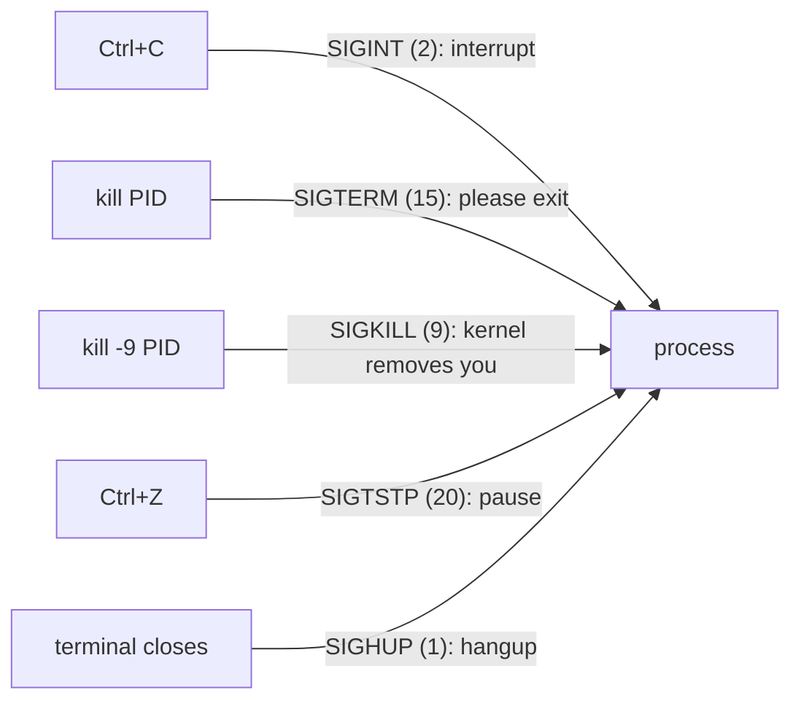

# 2 · Signals and job control

> **You'll learn:** to stop, pause, resume, and background any process - knowing exactly what Ctrl+C, kill, and kill -9 actually send, and when each is the right tool.

## Why this matters

Sooner or later something must be made to stop: the runaway script, the frozen app, the server that needs a graceful restart. Linux does all of this with **signals** - tiny numbered messages sent to processes - and the difference between a clean shutdown and corrupted data is often just *which* signal you chose.

## The big picture

You've been sending signals all along:



The crucial split: processes can *catch* most signals and react (save state, clean up temp files, reload config, ignore you). SIGTERM is a request. **SIGKILL is not** - the kernel simply deletes the process, no cleanup, no goodbye. That's why the polite-first eskalation ladder exists.

## kill: sending signals by PID

Despite the name, `kill` sends *any* signal:

```console
$ kill 4410                # no signal named = SIGTERM: "please shut down"
$ kill -15 4410            # same thing, explicit
$ kill -9 4410             # SIGKILL: the kernel ends it, uncatchably
$ kill -HUP 1234           # names work too: many daemons reload config on SIGHUP
$ kill -l                  # list all ~64 signals
```

The professional habit is an escalation with patience built in:

```text
kill PID   →  wait 10 s, check ps  →  kill PID again  →  kill -9 PID
(TERM: save & exit)                                      (last resort)
```

> [!WARNING]
> `kill -9` first is a bad habit, not a power move: the process gets zero chance to flush buffers, remove lock files, or close databases cleanly - that's how you meet "database recovery" screens. And one thing even `-9` can't kill: a process stuck in `D` state (lesson 1) is inside the kernel and unkillable until the I/O it's waiting on returns.

Hunting the PID first gets old, so pgrep/pkill fuse the steps:

```console
$ pgrep -a firefox          # find PIDs by name (-a shows the command too)
$ pkill -f "python3 server.py"    # signal by matching the full command line
$ pkill -u lab              # everything owned by lab (careful.)
```

## Job control: pausing and backgrounding

Your shell can run several things at once and juggle them - **jobs** are the shell's own bookkeeping of its children:

```console
$ sleep 500                 # foreground: the shell waits, your prompt is gone
^Z                          # Ctrl+Z: SIGTSTP pauses it (state T from lesson 1)
[1]+  Stopped    sleep 500
$ jobs                      # list this shell's jobs
[1]+  Stopped    sleep 500
$ bg                        # resume it in the background - prompt stays yours
[1]+ sleep 500 &
$ fg                        # bring it back to the foreground
```

Or skip the pause entirely: `command &` starts in the background directly (module 3's pipelines end with this trick a lot). `fg %1`, `bg %1`, `kill %1` address jobs by number when there are several.

## Surviving the terminal: nohup and disown

Close the terminal and everything you started gets **SIGHUP** - descended from the days when the *modem hung up* - and dies. For work that must outlive the session:

```console
$ nohup ./long-build.sh > build.log 2>&1 &     # immune to hangup, output captured
$ disown -h %1                                  # or retro-fit immunity to a running job
```

For interactive work you'll return to (over ssh especially), the modern answer is a terminal multiplexer - `tmux` - which module 7's SSH lesson picks up. And services that should *always* run belong to systemd (module 6), not to a backgrounded shell job.

<details>
<summary>🔍 Deep dive: traps - how scripts catch signals (and why 9 can't be caught)</summary>

Your own scripts can react to signals with `trap` - the classic use is cleaning up temp files even when the user Ctrl+C's you:

```bash
#!/bin/bash
tmp=$(mktemp)
trap 'rm -f "$tmp"; echo "cleaned up"; exit 1' INT TERM
echo "working with $tmp - try Ctrl+C..."
sleep 60
rm -f "$tmp"
```

Mechanically, a signal handler is a function the kernel forcibly makes your process jump to. SIGKILL (9) and SIGSTOP (19) are the two the kernel refuses to deliver to a handler at all - it just acts. If processes could catch SIGKILL, malware could make itself unkillable; the guarantee matters more than the flexibility.

Module 3's pipe mystery also resolves here: `yes | head -3` ends because when `head` exits, the next `write` by `yes` gets **SIGPIPE**, whose default action is death. Whole categories of Unix behaviour are just default signal dispositions.

</details>

## 🛠️ Try it

A stop-and-start lab - two terminals help for the finale:

1. Run `sleep 500`, pause it with Ctrl+Z, confirm with `jobs` and with `ps -o pid,stat,cmd -p $(pgrep sleep)` (expect `T`), resume it in the background, then kill it - politely.
2. Start three: `sleep 101 &`, `sleep 102 &`, `sleep 103 &`. Bring the *second* one to the foreground, Ctrl+C it, then `pkill` the remaining two in one command. Verify with `jobs`.
3. Write `~/bin/stubborn` - a script with `trap 'echo "nice try"' INT TERM` and a `sleep 300`. Run it in the foreground and try Ctrl+C, then from another terminal try `kill`, and finally `kill -9`. Watch the ladder in action.
4. Prove nohup works: `nohup sleep 300 &` , note the PID, close that terminal entirely, open a new one, and find the sleep still alive (whose child is it now? `ps -o ppid= -p PID`).
5. Reload-not-restart: run `man sudo` in one terminal (a live `less` process), and from another send it `SIGWINCH` (`kill -WINCH <pid>`) - the "window changed" signal. Nothing breaks; some signals are just... information. (This is the same signal your terminal sends on every resize.)

<details>
<summary>💡 Hint 1</summary>

Step 3: because INT and TERM are trapped, only the untrappable one ends it. Step 4: after the terminal dies, the orphaned sleep is adopted - lesson 1's deep dive says by whom (on modern Ubuntu it may be a per-user systemd instance rather than PID 1 itself - either counts).

</details>

<details>
<summary>✅ Solution</summary>

```console
$ sleep 500
^Z
$ jobs && ps -o pid,stat,cmd -p "$(pgrep -n sleep)"   # 1: state T
$ bg && kill %1                                       # SIGTERM - polite
$ sleep 101 & sleep 102 & sleep 103 &
$ fg %2                                               # 2
^C
$ pkill sleep && jobs
$ printf '#!/bin/bash\ntrap '\''echo "nice try"'\'' INT TERM\nsleep 300\n' > ~/bin/stubborn
$ chmod +x ~/bin/stubborn && stubborn                 # 3: Ctrl+C → "nice try"
$ pkill -f stubborn                                   # from terminal 2: "nice try" again
$ pkill -9 -f stubborn                                # gone - no message, no cleanup
$ nohup sleep 300 & disown                            # 4
$ # close terminal, open new one:
$ pgrep -a sleep && ps -o ppid= -p "$(pgrep -n sleep)"   # alive; parent is 1 (or user systemd)
```

(One nuance for step 3: while `stubborn`'s *script* traps the signal, the `sleep` child it is currently running doesn't - so plain `kill` behaviour can vary by timing. The lesson survives: TERM was catchable, KILL was not.)

</details>

## ✋ Checkpoint

1. Rank by destructiveness and name the number: SIGKILL, SIGTERM, SIGINT. Which would a well-written database like to receive for shutdown?
2. Predict: `sleep 100 &` then you close the terminal window. Is sleep alive 10 seconds later? Same question with `nohup sleep 100 &`.
3. `kill -9` on PID 8123 does nothing - it's still in ps, state `D`. What's going on and what subsystem do you investigate instead of the process?
4. In one line each: what do `jobs`, `fg`, and `bg` operate on - system-wide processes or something narrower?

<details>
<summary>Answers</summary>

1. SIGINT (2) < SIGTERM (15) < SIGKILL (9) in destructiveness order roughly - INT and TERM are both catchable requests (TERM is the standard "shut down"); KILL is uncatchable removal. The database wants SIGTERM: flush, sync, exit.
2. Plain background job: dead - the closing terminal HUPs its children. With nohup: alive, orphaned, adopted upward.
3. Uninterruptible sleep - it's blocked *inside* a kernel operation, almost always storage or network-filesystem I/O. Investigate the disk/NFS mount it's waiting on; the process ends when the I/O does.
4. Only the current shell's children - job control is per-shell bookkeeping, not a system-wide process manager.

</details>

## 📚 Further reading

- `man 7 signal` - the full table with default actions; the canonical reference
- `man bash` section JOB CONTROL - the ten paragraphs that make `%1` make sense

---

⬅️ [Previous: What a process is](01-what-a-process-is.md) · 🏠 [Course home](../README.md) · ➡️ [Next: /proc and /sys](03-proc-and-sys.md)
