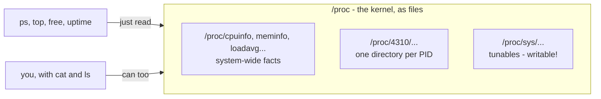

# 3 · /proc and /sys - the kernel as a filesystem

> **You'll learn:** to interrogate the kernel directly by reading files - every process's internals under /proc, hardware under /sys, and live kernel tunables under /proc/sys.

## Why this matters

Module 1 promised "everything is a file"; this is the full payoff. `ps`, `top`, `free`, `uptime` - none of them have special kernel access. They just read `/proc`, and you can too. When the packaged tools don't answer your exact question, the primary source is sitting there as plain text - and it's also how you *tune* the kernel without rebooting.

## The big picture

`/proc` is not a real disk directory - it's the kernel answering questions in file format, generated at the moment you read:

```console
$ cat /proc/uptime          # seconds up, seconds idle - the raw feed behind uptime
784032.11 5912831.90
$ cat /proc/loadavg         # lesson 1's numbers, from the source
0.31 0.28 0.24 1/312 48113
```



And `/sys` is its sibling: the same idea, organized around *devices and drivers* instead of processes.

## Every process, inside out: /proc/PID/

Each running process is a directory. Explore your own shell (`$$` from lesson 1):

```console
$ ls /proc/$$/
cmdline  cwd  environ  exe  fd  limits  status ...
```

| File | Contents | Try |
|---|---|---|
| `status` | the process's ID card: state, PIDs, UIDs, memory - human-readable | `head -20 /proc/$$/status` |
| `cmdline` | exact command line (NUL-separated) | `tr '\0' ' ' < /proc/$$/cmdline` |
| `cwd` | symlink to its *current directory* - live | `ls -l /proc/$$/cwd` |
| `exe` | symlink to the program binary | `ls -l /proc/$$/exe` |
| `environ` | its environment (module 3's export, verifiable) | `tr '\0' '\n' < /proc/$$/environ \| head` |
| `fd/` | every open file descriptor, as symlinks | `ls -l /proc/$$/fd` |

That `fd/` directory makes module 3's stream diagram touchable - descriptors 0, 1, 2 point at your pseudo-terminal right now - and it's how `lsof` finds module 2's deleted-but-open files: an `fd` symlink whose target says `(deleted)`.

> [!TIP]
> This is real diagnosis, not a museum: "what config did that daemon *actually* load?" → `ls -l /proc/PID/cwd` and `ls -l /proc/PID/fd`. "What environment is it really running with?" → `environ`. The process cannot be out of date with itself.

## System-wide facts

The other half of `/proc` describes the whole machine - the sources behind half the commands you know:

```console
$ grep "model name" /proc/cpuinfo | head -1     # what nproc and lscpu read
$ grep MemAvailable /proc/meminfo               # what free calls "available"
$ cat /proc/filesystems | head                  # every filesystem type this kernel speaks
$ cat /proc/version                             # the kernel build string (uname's source)
```

`/sys` continues the tour on the hardware side - one directory per device, one file per attribute:

```console
$ cat /sys/class/power_supply/BAT0/capacity     # laptop battery %, as promised in module 1
$ cat /sys/block/sda/size                       # disk size in 512-byte sectors
$ ls /sys/class/net/                            # your network interfaces (module 7 soon)
```

## /proc/sys: the kernel's control panel

One subtree is *writable*: `/proc/sys` holds thousands of live kernel tunables, with `sysctl` as the polite interface to them:

```console
$ sysctl vm.swappiness                  # dots map to slashes: /proc/sys/vm/swappiness
vm.swappiness = 60
$ sudo sysctl vm.swappiness=10          # change it - effective immediately, gone at reboot
$ sudo nano /etc/sysctl.d/99-local.conf # make it permanent: vm.swappiness = 10
$ sysctl -a 2>/dev/null | wc -l         # how many knobs exist? (thousands)
```

`vm.swappiness` (eagerness to swap), `fs.inotify.max_user_watches` (the one file-sync tools and IDEs always want raised), `net.ipv4.ip_forward` (is this box a router?) - when an install guide says "tune the kernel", this is all it means: writing a number into a file.

<details>
<summary>🔍 Deep dive: the OOM killer - who dies when memory runs out</summary>

When memory is truly exhausted - `available` gone, swap full - the kernel must free some or the whole machine locks up. Its last resort is the **Out-Of-Memory killer**: pick the process with the worst badness score, SIGKILL it, log it. The score is visible per process, and adjustable:

```console
$ cat /proc/$$/oom_score            # current badness (mostly: how much memory it uses)
$ cat /proc/$$/oom_score_adj        # nudge: -1000 (never kill) to +1000 (kill me first)
```

systemd uses `oom_score_adj` to shield critical services, and you can too (a batch job that should die before the database gets a positive nudge). If a process ever vanishes mysteriously overnight, module 6's journal reading will show the tell-tale line - `Out of memory: Killed process ...` - and now you know which subsystem wrote it and why it chose that victim.

</details>

## 🛠️ Try it

All read-only except step 5 - answers into `~/linux-course/exercises/proc-spelunking.txt`:

1. Inspect your shell from outside: its state from `status` (grep `State:`), its exact binary from `exe`, and all its open descriptors from `fd/`. Where do fd 0, 1, 2 point?
2. Prove `environ` is module 3's export mechanism: `export PROOF=hello`, start a child `sleep 300 &`, and find PROOF inside `/proc/<sleepPID>/environ`. Then kill the sleep, lesson-2 style.
3. Answer with /proc or /sys only - no ps, no free, no lscpu: (a) how many CPU cores? (b) MemAvailable, roughly in GB? (c) your network interface names?
4. Recreate a deleted-open file (module 2's mystery, now visible): `sleep 300 > /tmp/ghost.txt &` then `rm /tmp/ghost.txt`, then find the `(deleted)` entry under `/proc/<pid>/fd/`. Clean up.
5. Read `vm.swappiness`, set it to 10 with sysctl, confirm, then set it back to 60. One tunable, full round trip, nothing permanent.

<details>
<summary>💡 Hint 1</summary>

Step 3: (a) `grep -c ^processor /proc/cpuinfo` (b) `grep MemAvailable /proc/meminfo` (c) `ls /sys/class/net`. Step 4: the descriptor belongs to the *sleep* process - `ls -l /proc/$(pgrep -n sleep)/fd`.

</details>

<details>
<summary>✅ Solution</summary>

```console
$ grep State: /proc/$$/status                    # 1: S (sleeping) - it's waiting for your keystrokes
$ ls -l /proc/$$/exe                             # → /usr/bin/bash
$ ls -l /proc/$$/fd                              # 0,1,2 → /dev/pts/0 - the pseudo-terminal
$ export PROOF=hello && sleep 300 &
$ tr '\0' '\n' < /proc/$(pgrep -n sleep)/environ | grep PROOF   # 2: PROOF=hello
$ kill %1
$ grep -c ^processor /proc/cpuinfo               # 3a
$ grep MemAvailable /proc/meminfo                # 3b: divide kB by ~1,000,000
$ ls /sys/class/net                              # 3c: lo + your real interfaces
$ sleep 300 > /tmp/ghost.txt & rm /tmp/ghost.txt
$ ls -l /proc/$(pgrep -n sleep)/fd | grep deleted    # 4: 1 → '/tmp/ghost.txt (deleted)'
$ kill %1
$ sysctl vm.swappiness                           # 5: 60
$ sudo sysctl vm.swappiness=10 && sysctl vm.swappiness
$ sudo sysctl vm.swappiness=60
```

</details>

## ✋ Checkpoint

1. Predict: `ls -l /proc/$$/cwd`, then `cd /tmp`, then the same `ls` again. Does the symlink's target change - and why is that impossible for a normal symlink?
2. A monitoring agent needs memory stats every second. Someone proposes parsing `free`'s output; a reviewer says "go to the source". What file, and name one advantage.
3. `du -sh /proc` reports something absurd (0, or terabytes). Why is the question itself broken?
4. You set `vm.swappiness=10` with sysctl and it worked beautifully - until the reboot. What did you forget, and where does the fix live?

<details>
<summary>Answers</summary>

1. It changes - from your old directory to `/tmp`. `/proc` symlinks are generated live by the kernel to reflect *current* process state; a disk symlink is a static stored path.
2. `/proc/meminfo` - no subprocess to spawn, no output format to parse fragilely, and it's exactly where free gets the numbers anyway.
3. `/proc` files have no real size - they're generated at read time (most `stat` as 0 bytes). Measuring their "disk usage" measures a fiction; nothing there is on disk at all.
4. sysctl writes are runtime-only. Persistence is a line in `/etc/sysctl.d/99-local.conf`, applied at every boot.

</details>

## 📚 Further reading

- `man 5 proc` - the complete /proc catalogue; one of the great man pages
- [The /sys filesystem (kernel docs)](https://www.kernel.org/doc/html/latest/filesystems/sysfs.html) - how drivers expose those attribute files

---

⬅️ [Previous: Signals and job control](02-signals-and-job-control.md) · 🗺️ [Course map](../README.md) · ➡️ [Next: Syscalls and strace](04-syscalls-and-strace.md)
