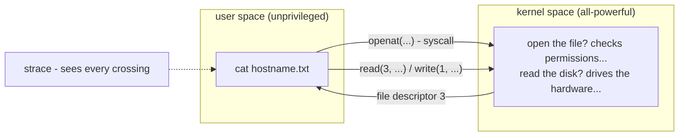

# 4 · Syscalls and strace - watching the kernel boundary

> **You'll learn:** what a system call is, and how to watch any program's entire conversation with the kernel - answering "what is this thing actually doing?" without source code.

## Why this matters

Programs can lie in their logs, docs can be wrong about which config file gets read - but no program can hide its system calls. strace shows the ground truth: every file opened, every byte written, every failed lookup, straight from the kernel boundary. It's the debugging tool of last resort that regularly should have been the first.

## The big picture

A process cannot open a file, print text, or even exit on its own - the CPU won't let it touch hardware. It must *ask the kernel*, and each ask is a **system call**:



Install the wiretap and point it at something small (output below is trimmed to the plot):

```console
$ sudo apt install strace
$ strace cat /etc/hostname
execve("/usr/bin/cat", ["cat", "/etc/hostname"], ...) = 0
openat(AT_FDCWD, "/etc/hostname", O_RDONLY)          = 3
read(3, "mybox\n", 131072)                           = 6
write(1, "mybox\n", 6)                               = 6
close(3)                                             = 0
exit_group(0)                                        = ?
```

Read one line: *syscall(arguments) = return value*. `openat` returned descriptor 3 (0-2 were taken - module 3 again); `read` pulled 6 bytes from it; `write` pushed them to descriptor 1, stdout. You have now seen `cat`'s entire job description.

## The vocabulary: ~450 verbs, a dozen that matter

Every program, in any language, funnels down to the same small set of calls:

| Family | Calls | What they do |
|---|---|---|
| Files | `openat`, `read`, `write`, `close`, `statx` | everything file-shaped |
| Processes | `fork`/`clone`, `execve`, `wait4`, `exit_group` | module 1's fork+exec, for real |
| Signals | `kill`, `rt_sigaction` | lesson 2: sending, and installing traps |
| Network | `socket`, `connect`, `accept`, `sendto` | module 7 territory |
| Memory | `mmap`, `brk` | how malloc gets pages |

`man 2 openat` documents any of them (module 1's manual section 2, finally visited). The names appear constantly in error messages and security tooling - recognizing the families is the literacy; memorizing arguments is not required.

## Driving strace

Raw strace is a firehose - even `ls` makes hundreds of calls (library loading, locale files...). The craft is filtering:

```console
$ strace -c ls /etc > /dev/null         # -c: just count and summarize per syscall
$ strace -e trace=openat ls /etc        # only one syscall type: what does it open?
$ strace -e trace=%file cat /etc/hostname   # a whole family: every file-touching call
$ strace -f ./myscript.sh 2> trace.log  # -f: follow children (fork/exec chains!)
$ strace -p 4310                        # attach to something already running (sudo usually)
```

Two workhorse investigations you can run today:

```console
$ strace -e trace=%file -o /dev/null bash -c 'echo hi' 2>&1 | grep -E 'bashrc|profile'
# "which startup files does bash really read?" - lesson 4 of module 3, now provable
$ strace -e trace=openat myapp 2>&1 | grep -E 'conf|ENOENT'
# "which config does it read - and which did it LOOK for and miss?" (ENOENT = not found)
```

That `ENOENT` trick is the classic: the file a program *fails* to find, and where it searched, is exactly the thing its error message forgot to mention.

> [!TIP]
> strace prints to *stderr* (stdout belongs to the traced program) - hence the `2>&1` before piping to grep, or `-o file` to write the trace somewhere. Module 3's stream discipline, load-bearing as usual.

## Reading a failure

Failed syscalls return negative, with the error name attached - and failures are where the answers live:

```console
$ strace -e trace=openat cat /etc/shadow
openat(AT_FDCWD, "/etc/shadow", O_RDONLY) = -1 EACCES (Permission denied)
```

| Error | Meaning | Usual story |
|---|---|---|
| `ENOENT` | no such file | wrong path, missing config, PATH search in action |
| `EACCES` | permission denied | module 2, in kernel dialect |
| `ECONNREFUSED` | connection refused | nothing listening at that port |
| `EAGAIN` | try again | non-blocking I/O doing its thing - usually harmless |

"Permission denied" from an app is a summary; `EACCES` on a specific path at a specific syscall is a diagnosis.

<details>
<summary>🔍 Deep dive: what a syscall physically is - and why it isn't free</summary>

A syscall is not a function call - it's a controlled privilege switch. The program puts the syscall number in a CPU register (`openat` is 257 on x86-64), arguments in others, and executes the `syscall` instruction. The CPU flips from unprivileged *user mode* to privileged *kernel mode*, jumps to the kernel's single entry point, and the kernel - after checking every argument, because user space is never trusted - does the work and flips back.

That mode switch costs on the order of a microsecond - tiny, but thousands of times slower than a normal function call, which shapes real software: buffered I/O exists so programs make one 64 KB `write` instead of 65,536 one-byte ones (`strace -c` on both tells the story instantly). And for the few calls too hot even for that - `gettimeofday`, famously - the kernel maps a page of its own code+data into every process (the **vDSO**, visible as `[vdso]` in `/proc/self/maps`) so "what time is it?" never crosses the boundary at all.

</details>

## 🛠️ Try it

Wiretap week - findings into `~/linux-course/exercises/strace-findings.txt`:

1. Warm-up: `strace -c ls /etc > /dev/null`. Which syscall wins on count? Any failures (the errors column)?
2. Prove the PATH search: `strace -e trace=execve,statx -f bash -c 'hello' 2>&1 | grep hello` (your module-3 `~/bin/hello`). Watch bash *probe* directories in $PATH order before finding it. (Depending on build, the probing shows as `statx` or `access` - adjust the filter.)
3. The ENOENT hunt: `strace -e trace=openat bash -c 'exit' 2>&1 | grep -c ENOENT` - even starting a shell involves dozens of hopeful lookups that miss. Find one `.bashrc`-related line among them.
4. Compare buffering: `strace -c wc -l /var/log/dpkg.log` vs `strace -c cat /var/log/dpkg.log > /dev/null` - compare the `read` counts to the file size. Who reads bigger sips?
5. Attach to a live process: in terminal A run `sleep 300`; in terminal B, `sudo strace -p $(pgrep -n sleep)` - and see... nearly nothing (it's *sleeping in a syscall* - which one?). Ctrl+C the strace; the sleep survives.
6. Capstone question, answered by trace alone: does `ls --color=auto` (your module-3 alias) open any file to decide its colors? (`strace -e trace=%file ls 2>&1 | grep -iv 'lib\|locale' | head -20` - look for something DIR_COLORS-ish.)

<details>
<summary>💡 Hint 1</summary>

Step 5: the trace shows it parked in `clock_nanosleep(...)` - sleep(1) is one syscall and 300 seconds of kernel-side waiting. That's also why its state was S in lesson 1.

</details>

<details>
<summary>✅ Solution</summary>

```console
$ strace -c ls /etc > /dev/null                  # 1: openat/statx/close dominate; a few ENOENT errors is normal
$ strace -e trace=execve,statx -f bash -c 'hello' 2>&1 | grep hello
statx(AT_FDCWD, "/usr/local/sbin/hello", ...) = -1 ENOENT   # 2: probing $PATH, in order...
statx(AT_FDCWD, "/home/steve/bin/hello", ...) = 0           # found where you put it
execve("/home/steve/bin/hello", ...)                        # then run
$ strace -e trace=openat bash -c 'exit' 2>&1 | grep bashrc  # 3: openat(... "/home/steve/.bashrc" ...)
$ strace -c wc -l /var/log/dpkg.log              # 4: compare "read" call counts -
$ strace -c cat /var/log/dpkg.log > /dev/null    #    both buffer well; divide file size by reads for sip size
$ sudo strace -p $(pgrep -n sleep)               # 5: clock_nanosleep(CLOCK_REALTIME, ...  - parked
$ strace -e trace=%file ls 2>&1 | grep -i color  # 6: no file - the palette comes from the
                                                 #    LS_COLORS environment variable (check env!)
```

(Exact syscall names vary slightly across versions - `access` vs `statx`, `open` vs `openat`. The shapes stay the same; adapt and continue.)

</details>

## ✋ Checkpoint

1. Predict roughly what `strace echo hi` shows between `execve` and `exit_group` - which syscall *must* be there, and with which file descriptor?
2. An app says only "config error". Give the strace one-liner that finds which config files it tried and failed to open.
3. Why does even `ls` open dozens of files that aren't in the directory being listed? (Step 1 showed them.)
4. From the deep dive: why is reading a file byte-by-byte thousands of times slower than in 64 KB chunks, when the *disk* work is identical?

<details>
<summary>Answers</summary>

1. `write(1, "hi\n", 3) = 3` - stdout is descriptor 1, and printing is a write syscall. (Plus mmap/openat noise from loading libc first.)
2. `strace -e trace=openat theapp 2>&1 | grep ENOENT` - every hopeful path, in search order, with the misses marked.
3. Dynamic libraries (libc and friends), locale data, and terminal/color configuration - a program's *runtime* is assembled from files before main() ever runs.
4. Each read is a syscall, and each syscall is a mode switch costing ~a microsecond regardless of payload. A million switches for a megabyte is pure overhead; 16 switches for the same megabyte is free. Buffering exists to amortize the boundary crossing.

</details>

## 📚 Further reading

- `man 2 syscalls` - the full catalogue, with the kernel version each call arrived in
- [Julia Evans: strace zine](https://jvns.ca/strace-zine-v2.pdf) - the most fun anyone has had explaining a debugging tool
- `man 2 openat`, `man 2 execve` - read two real syscall pages to cement the section-2 habit

---

⬅️ [Previous: /proc and /sys](03-proc-and-sys.md) · 🏠 [Course home](../README.md) · ➡️ Next module: [Software & Packages](../module-05-software-and-packages/README.md)
