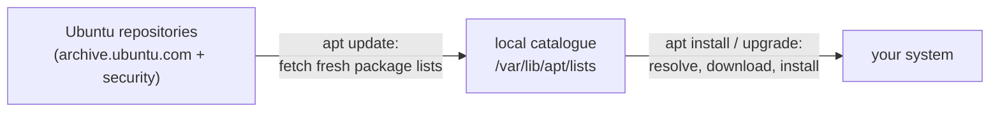

# 1 · apt essentials - the daily driver

> **You'll learn:** to install, update, inspect, and cleanly remove software with apt - and keep a whole system patched with four commands.

## Why this matters

Nearly every piece of software on an Ubuntu box - the kernel, bash, this course's htop and strace - arrived as a **package** and gets its security fixes the same way. apt is how you'll install every tool for the rest of your career, and "keep the system updated" is the single highest-value security habit that exists. It's also blessedly easy.

## The big picture

Software comes from **repositories** - Canonical's servers full of signed packages - and apt's model is two-phase: *refresh the catalogue*, then *act on it*:



The daily/weekly ritual, in full:

```console
$ sudo apt update            # refresh the catalogue (installs NOTHING)
$ apt list --upgradable      # optional: see what's pending
$ sudo apt upgrade           # apply the updates
$ sudo apt autoremove        # sweep up no-longer-needed dependencies
```

The classic beginner confusion dies here: **`update` updates apt's knowledge; `upgrade` updates your software.** Update never touches installed packages; upgrade without a fresh update works from a stale catalogue.

## Installing and removing

```console
$ sudo apt install htop                  # one package (dependencies come automatically)
$ sudo apt install cowsay tldr shellcheck    # several at once
$ sudo apt remove cowsay                 # uninstall (config files stay)
$ sudo apt purge cowsay                  # uninstall AND delete its system config
$ sudo apt autoremove                    # remove dependencies nothing needs anymore
```

`remove` vs `purge`: remove keeps the package's system-wide config in `/etc` (nice if you'll reinstall); purge deletes that too. Neither touches your *personal* config in `~` - dotfiles are yours, not the package's.

The catalogue is also a search engine - no browser needed:

```console
$ apt search markdown editor      # full-text search (broad - pipe to less)
$ apt show htop                   # one package's full card: description, size, deps
$ apt list --installed | wc -l    # what's on this box?
$ apt list --upgradable           # what's pending?
```

> [!TIP]
> Notice which commands needed sudo and which didn't: *reading* (search, show, list) is unprivileged; *changing the system* (update's catalogue refresh, install, remove) is root's business. apt even politely suggests the sudo when you forget.

## Staying current: upgrades and the unattended kind

`apt upgrade` applies everything pending. Two siblings matter:

```console
$ sudo apt full-upgrade      # like upgrade, but may also REMOVE packages if a new
                             # version requires it (kernel transitions, big bumps)
$ apt list --upgradable 2>/dev/null | grep -i security    # what's security vs feature?
```

And the one Ubuntu already runs without you: **unattended-upgrades** installs *security* updates automatically in the background - it's why a neglected Ubuntu box is still mostly patched. See it working:

```console
$ systemctl status unattended-upgrades          # module 6 explains this command fully
$ less /var/log/unattended-upgrades/unattended-upgrades.log
```

Kernel updates are the exception that needs you: they take effect only at the next boot. Ubuntu tells you with a `*** System restart required ***` login banner (the file `/run/reboot-required` behind it is checkable by scripts).

<details>
<summary>🔍 Deep dive: what actually happens during apt install</summary>

`sudo apt install htop` runs a five-act play:

1. **Resolve** - apt reads the catalogue and computes a plan: htop plus any dependencies not yet installed, checking version constraints. (Since apt 3.0 this is a new solver, and the output you see - colored columns of installs/upgrades/removals - is its summary. Read the plan before typing `y`; the day it says "removing: 47 packages" is the day reading saved the machine.)
2. **Download** - fetches signed `.deb` files into `/var/cache/apt/archives/`.
3. **Verify** - checks every file against the repository's cryptographic signatures. A tampered mirror fails here.
4. **Unpack** - hands over to `dpkg` (next lesson's star) to place files onto the filesystem.
5. **Configure** - runs the package's setup scripts, registers services, updates caches.

The division of labour matters: apt is the *strategist* (repositories, dependencies, downloads); dpkg is the *soldier* (files on disk, local database). Next lesson opens dpkg up.

</details>

## 🛠️ Try it

Groom your system - and install the rest of the course's toolkit while you're at it:

1. Full ritual: `sudo apt update`, count the upgradable packages, `sudo apt upgrade`, then `sudo apt autoremove`. Note roughly how many packages moved.
2. Toolkit: install `htop`, `tldr`, `shellcheck`, and `ncdu` in one command (module 4 wanted htop; modules 3 and 7 want the others).
3. Window-shop: find a command-line weather program with `apt search weather` and read its card with `apt show` (candidate: `wego` or classic `ansiweather`). Don't install - just decide whether you would.
4. Life cycle drill: install `cowsay`, run `cowsay moo`, then `remove` it, then check `apt show cowsay` still knows it, then `purge` it. What's the difference in what remained?
5. Audit: is a reboot pending on your machine (`cat /run/reboot-required` - "No such file" is an answer too)? And when did unattended-upgrades last act (its log, or `ls -lt /var/log/unattended-upgrades/`)?

<details>
<summary>💡 Hint 1</summary>

Step 4: after `remove`, `dpkg -l cowsay` shows state `rc` - removed, config remains (full decoding next lesson). After purge, it's gone entirely. Config for a toy like cowsay is nearly empty - the *states* are the lesson.

</details>

<details>
<summary>✅ Solution</summary>

```console
$ sudo apt update && apt list --upgradable | wc -l        # 1
$ sudo apt upgrade && sudo apt autoremove
$ sudo apt install htop tldr shellcheck ncdu              # 2
$ apt search weather | less                               # 3
$ apt show ansiweather                                    # size, deps, description - informed shopping
$ sudo apt install cowsay && cowsay moo                   # 4
$ sudo apt remove cowsay && dpkg -l cowsay | tail -1      # rc = config remnants
$ sudo apt purge cowsay && dpkg -l cowsay 2>&1 | tail -1  # no longer installed
$ cat /run/reboot-required 2>&1                           # 5
$ ls -lt /var/log/unattended-upgrades/ | head -3
```

</details>

## ✋ Checkpoint

1. A tutorial says "run `sudo apt update` to update your system". Grade the sentence.
2. Predict: you `apt remove nginx`, later reinstall it. Your carefully edited `/etc/nginx/nginx.conf` - default or your version? Same question if you'd purged.
3. Why is it *safe* for `apt search` to work without sudo but *right* for `apt install` to require it? (Module 2 has the vocabulary.)
4. Your laptop was off for a month. Give the exact command sequence to bring it fully current, including the check for whether a reboot is owed.

<details>
<summary>Answers</summary>

1. Half-right and dangerously incomplete: `apt update` only refreshes the catalogue. Updating the *system* is `sudo apt update && sudo apt upgrade`.
2. After remove+reinstall: your version survived (remove keeps /etc config). After purge+reinstall: factory default - purge deleted it.
3. Searching only reads world-readable catalogue files; installing writes to /usr, /etc, and dpkg's database - root-owned system state. Least privilege, exactly as module 2 preached.
4. `sudo apt update && sudo apt upgrade` (add `sudo apt full-upgrade` if held-back packages appear), `sudo apt autoremove`, then `cat /run/reboot-required` - and reboot if it exists (a month likely included a kernel).

</details>

## 📚 Further reading

- [Ubuntu Server docs: package management](https://documentation.ubuntu.com/server/how-to/software/package-management/) - Canonical's own apt guide
- `man apt` - short and readable, unlike its ancestors `apt-get`/`apt-cache` (which the page explains it superseded for interactive use)

---

⬅️ [Module home](README.md) · 🗺️ [Course map](../README.md) · ➡️ [Next: Under the hood - dpkg, .debs, repositories](02-under-the-hood-dpkg-and-repos.md)
