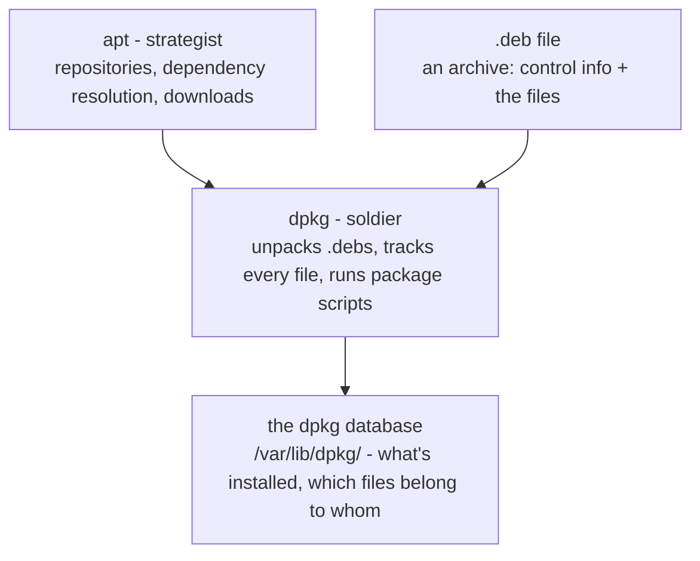

# 2 · Under the hood - dpkg, .debs, and repositories

> **You'll learn:** to interrogate the package database (which package owns this file? what did that package install?), dissect a .deb with your own hands, and read the files that define where software comes from.

## Why this matters

apt answers "get me htop"; dpkg answers the investigator's questions: *what put this file here? what exactly did that package change? what version is installed, and is it intact?* And knowing how repositories are defined - and verified - is the difference between managing your software supply chain and hoping about it.

## The big picture

Lesson 1's deep dive split the roles; here's the full stack:



The three dpkg queries you'll use forever:

```console
$ dpkg -l | head                  # list installed packages (the database, tabulated)
$ dpkg -L htop                    # what files did htop install? (List)
$ dpkg -S /usr/bin/htop           # which package owns this file? (Search)
htop: /usr/bin/htop
```

## Reading the database

`dpkg -l` lines start with a two-letter state - `ii` is "should be installed, is installed", and lesson 1's `rc` was "removed, config remains":

```console
$ dpkg -l htop
ii  htop  3.4.0-2  amd64  interactive processes viewer
$ dpkg -l | awk '$1=="rc"' | head          # module 3 reflexes: all the config remnants
$ dpkg -s htop                             # one package's full database record (Status)
```

The ownership queries shine in real work. Something misbehaving in `/etc`? Find its owner, then its siblings:

```console
$ dpkg -S /etc/ssh/sshd_config
openssh-server: /etc/ssh/sshd_config
$ dpkg -L openssh-server | grep systemd    # ...and the service files it shipped (module 6 soon)
```

Run it on an old friend and Ubuntu 26.04 shows its colours:

```console
$ dpkg -S "$(readlink -f /usr/bin/ls)"     # who provides ls these days?
```

On 26.04 the answer names the Rust coreutils package - module 1's `ls --version` discovery, now confirmed at the supply-chain level.

## Anatomy of a .deb

A `.deb` is just an archive - and you have the tools to open one honestly:

```console
$ apt download cowsay                      # fetch the .deb WITHOUT installing (no sudo!)
$ dpkg-deb --info cowsay_*.deb             # the control data: version, deps, description
$ dpkg-deb --contents cowsay_*.deb | head  # every file, with its destined path
```

Inside every .deb: **control** (metadata: name, version, `Depends:` list, and the maintainer scripts that run at install/remove time) and **data** (the actual files, as a tarball rooted at `/`). Installation is, at heart: unpack data onto the filesystem, record every path in the database, run the configure script. No registry, no mystery - files plus bookkeeping.

> [!WARNING]
> That "maintainer scripts run at install time" detail is the security model's sharp edge: installing a package runs *its author's code as root*. From Ubuntu's signed repositories, that's Canonical's supply chain vouching for it. A random `.deb` from a website is `curl | sudo bash` in a nicer suit - treat it accordingly.

## Where packages come from: sources

The repositories apt consults are defined in plain files. Modern Ubuntu uses one main file in **deb822 format**:

```console
$ cat /etc/apt/sources.list.d/ubuntu.sources
Types: deb
URIs: http://archive.ubuntu.com/ubuntu/
Suites: resolute resolute-updates resolute-backports
Components: main universe restricted multiverse
Signed-By: /usr/share/keyrings/ubuntu-archive-keyring.gpg
```

| Field | Meaning |
|---|---|
| Suites | which pockets: release itself, `-updates` (post-release fixes), `-security` (its own entry, separate server) |
| Components | `main` (Canonical-supported) / `universe` (community) / `restricted` + `multiverse` (non-free drivers, encumbered media) |
| Signed-By | the public key that everything from this source must be signed with |

`sudo apt update` now reads honestly: *for each source in these files, fetch the signed package index*. Third-party repositories (Docker's, PostgreSQL's - lesson 3) drop their own `.sources` file plus key into the same directories.

<details>
<summary>🔍 Deep dive: the chain of trust, link by link</summary>

How does a package cross the untrusted internet safely? A chain of signatures and hashes:

1. Each repository publishes a **Release file** - a manifest listing the SHA-256 hash of every package index - and a detached **signature** of it, made with the repository's private key.
2. `apt update` verifies that signature against the *local* public key named in `Signed-By`. Key not on your disk, or signature wrong → the source is rejected (you've seen the `NO_PUBKEY` error in the wild).
3. Each package index, now trusted via its hash, lists the SHA-256 of every `.deb`.
4. Each downloaded `.deb` is hashed and checked before dpkg touches it.

So the mirror, the CDN, and every router in between are untrusted - and don't need to be. Trust reduces to: *which public keys live on your disk*. That's why adding a third-party repository (next lesson) means adding a key, and why that step deserves a moment of thought each time.

Bonus of the design: `sudo apt install` can fearlessly resume interrupted downloads, use local mirrors, even install from a USB stick of cached .debs - integrity is verified at the end, not assumed from the transport.

</details>

## 🛠️️ Try it

Detective work - findings into `~/linux-course/exercises/packages.txt`:

1. Who owns your shell? `dpkg -S "$(readlink -f /usr/bin/bash)"` - then list five other files that package installed.
2. The Rust check: `dpkg -S` on the real paths of `ls` and of `cp` (readlink -f both). Which packages - and does it match module 1's `--version` findings (uutils vs GNU)?
3. Dissect without installing: `apt download hello`, then `--info` and `--contents` it. What does it Depend on? Where would its files land? Delete the .deb after.
4. How big is the database? Count `ii` packages vs `rc` remnants (`dpkg -l | awk '$1=="ii"' | wc -l` and friends). Purge one remnant if you have any (`sudo apt purge <name>`).
5. Read your actual sources: `cat /etc/apt/sources.list.d/ubuntu.sources`. Which suites and components is this machine drinking from? Is `-security` listed in the same file or its own stanza?
6. Integrity spot-check: `dpkg -V coreutils` (or any package) - silence means every file still matches its recorded hash. Modify nothing; just appreciate that the check exists.

<details>
<summary>💡 Hint 1</summary>

Step 3: `hello` is GNU's official demo package - tiny and always in the archive. If `apt download` complains about the current directory, cd somewhere you own (module 2 knew why: apt's sandbox user needs write permission there - use `/tmp`).

</details>

<details>
<summary>✅ Solution</summary>

```console
$ dpkg -S "$(readlink -f /usr/bin/bash)"          # 1: bash: /usr/bin/bash
$ dpkg -L bash | head                              # /bin/sh? no - but docs, skeleton files...
$ dpkg -S "$(readlink -f /usr/bin/ls)"            # 2: the rust-coreutils package
$ dpkg -S "$(readlink -f /usr/bin/cp)"            #    coreutils (GNU) - matching module 1
$ cd /tmp && apt download hello                    # 3
$ dpkg-deb --info hello_*.deb                      # Depends: libc6 (>= ...)
$ dpkg-deb --contents hello_*.deb                  # /usr/bin/hello, man page, docs
$ rm hello_*.deb
$ dpkg -l | awk '$1=="ii"' | wc -l                # 4: ~1500-2500 on desktop
$ dpkg -l | awk '$1=="rc"{print $2}'              # your remnants, if any
$ cat /etc/apt/sources.list.d/ubuntu.sources       # 5: resolute + updates + backports;
                                                   #    security usually its own stanza/URI
$ dpkg -V coreutils && echo intact                 # 6
```

</details>

## ✋ Checkpoint

1. Two commands walked into a crime scene: a mystery binary at `/usr/local/bin/deploy` and one at `/usr/bin/rg`. `dpkg -S` answers for one and shrugs "no path found" for the other. Which, and what does the shrug tell you?
2. Predict: `apt download nginx` on a machine where nginx is already installed - error, no-op, or a fresh .deb in your directory?
3. A colleague wants to `sudo dpkg -i random-vendor.deb`. Give the two-line risk briefing, and the one command to at least *look inside first*.
4. In the trust chain, what single local fact ultimately decides whether a repository is believed - and where did lesson's sources file point at it?

<details>
<summary>Answers</summary>

1. `/usr/bin/rg` gets an answer (ripgrep, if installed via apt); `/usr/local/bin/deploy` gets the shrug - `/usr/local` is by convention *outside* dpkg's world: hand-installed, unmanaged, and now you know it (lesson 4 makes this distinction load-bearing).
2. A fresh .deb in your directory - download just fetches the file from the repository; installed-or-not is irrelevant.
3. "Its maintainer scripts run as root at install; there's no signature chain vouching for it - this is trusting the vendor completely." Look first: `dpkg-deb --info` and `--contents` (and `dpkg -i` doesn't resolve dependencies anyway - `apt install ./random-vendor.deb` at least does that).
4. The public key on your disk, named by the `Signed-By:` field - `/usr/share/keyrings/ubuntu-archive-keyring.gpg` for Ubuntu's own archive.

</details>

## 📚 Further reading

- `man dpkg` and `man dpkg-deb` - the query flags reward skimming
- [Debian policy: what's in a package](https://www.debian.org/doc/debian-policy/ch-binary.html) - Ubuntu inherits all of this; chapter 3 is the anatomy lesson in full
- `man sources.list` - the deb822 format, every field

---

⬅️ [Previous: apt essentials](01-apt-essentials.md) · 🏠 [Course home](../README.md) · ➡️ [Next: Snaps and other channels](03-snaps-and-other-channels.md)
