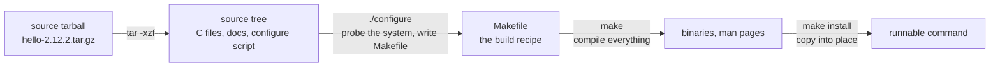

# 4 · From source - ./configure, make, and why packages exist

> **You'll learn:** to unpack a source tarball, build it with the classic configure-make ritual, install it without making a mess - and articulate exactly what package managers have been saving you from.

## Why this matters

Sometimes there is no package: the tool is too new, too niche, or you need a patched version. "Build from source" is the fallback that always exists - and doing it once, hands-on, transforms your mental model of every package you'll ever install. After this lesson, a .deb stops being magic and becomes "someone did this build, once, properly, for everyone".

## The big picture

The ritual, unchanged since the 1990s:



```console
$ sudo apt install build-essential        # the toolchain: gcc, make, and friends
$ tar -xzf hello-2.12.2.tar.gz && cd hello-2.12.2
$ ./configure --prefix="$HOME/.local"
$ make
$ make install
$ hello
Hello, world!
```

Four commands - and each one exists for a reason worth knowing.

## tar: the container everything ships in

Source code travels as a **tarball** - a tar archive (files glued into one stream) usually compressed (`.tar.gz`/`.tgz`, or the denser `.tar.xz`). The flags that matter:

```console
$ tar -tzf hello-2.12.2.tar.gz | head     # -t: list contents BEFORE unpacking (always look)
$ tar -xzf hello-2.12.2.tar.gz            # -x extract, -z gunzip, -f this file
$ tar -xJf something.tar.xz               # -J for .xz
$ tar -czf backup.tar.gz ~/linux-course   # -c create: your module-3 backup script, upgraded
```

Well-mannered tarballs unpack into a single directory named like themselves. The `-t` peek first is the same habit as `echo *.txt` before `rm` - know what you're about to do to your filesystem.

> [!NOTE]
> Mnemonic for the only three invocations you need: e**X**tract `-xzf`, lis**T** `-tzf`, **C**reate `-czf`. The `z` swaps for `J` when the name ends `.xz`.

## configure, make, make install - what each really does

**`./configure`** is a (giant, generated) shell script - module 3 taught you exactly what that is - that probes your system: which compiler? is libc where we think? are optional libraries present? It writes the answers into a `Makefile` tailored to your machine. Its flags are the build's options; `./configure --help` lists them, and one matters most:

```console
$ ./configure --prefix="$HOME/.local"     # install destination: ~/.local/bin, ~/.local/share/man...
```

**`make`** reads the Makefile - a dependency graph of *this file is built from those, via this command* - and runs the compiles, in order, in parallel (`make -j"$(nproc)"`), skipping anything already up to date. Rerun it after editing one source file and it rebuilds only what that file touches: make is `find -newer` with a plan.

**`make install`** copies the results into the prefix. And here is the trap the whole lesson has been walking toward: with the default prefix `/usr/local`, that step needs sudo and scatters files that *nothing tracks*. Lesson 2's checkpoint met this exact ghost: `dpkg -S` shrugging at `/usr/local/bin/deploy`. No database, no `apt remove`, no security updates - the un-package. Which is why:

- `--prefix="$HOME/.local"` - no sudo, and Ubuntu's `~/.profile` already puts `~/.local/bin` on PATH (module 3 closed that loop). Personal tools live here happily.
- If it must be system-wide, keep the source tree: a well-made project offers `make uninstall`, and only the Makefile knows the file list.

## Why packages exist (the lesson inside the lesson)

Do the exercise below, then re-read this table - it will have become obvious:

| You, building from source | A package |
|---|---|
| find deps by configure failing, repeatedly | `Depends:` resolved automatically |
| files copied in, remembered by nobody | every path in dpkg's database |
| uninstall = hope for make uninstall | `apt remove`, always |
| updates = you, noticing, rebuilding | unattended-upgrades while you sleep |
| built for this one box | built once, signed, verified everywhere |

A .deb is *someone else's make install*, captured, tracked, and made reversible. All of module 5 has been about the machinery around that capture.

<details>
<summary>🔍 Deep dive: apt as a source-code service, and the modern build babel</summary>

Two closing notes. First: the archive serves *source* too - `apt source hello` fetches the exact source Ubuntu built your package from (needs a `deb-src` entry enabled in your sources - lesson 2's files again), and `sudo apt build-dep hello` installs everything needed to build it. That pair is the honest way to patch-and-rebuild an Ubuntu package, and reading a real package's source tree is an education in itself.

Second: configure/make is the *classic* interface, not the only one. Modern projects greet you with `cmake`, `meson`/`ninja`, `cargo build` (Rust - your coreutils were born this way), `go build`, `npm install`... Different incantations, same four movements every time: *fetch → configure for this machine → compile → place files*. Find the project's README, map its commands onto those movements, and no build system is truly foreign.

</details>

## 🛠️ Try it

Build GNU hello - the package you dissected in lesson 2, now from raw source. In `/tmp` (a build tree is scratch by nature):

1. Toolchain first: `sudo apt install build-essential`, then prove it: `gcc --version`.
2. Fetch and inspect: `wget https://ftpmirror.gnu.org/hello/hello-2.12.2.tar.gz`, list its contents *without* extracting, then extract and `cd` in. (Also try `ls` - read a real source tree: README, configure, src/.)
3. Configure for a no-sudo install: `./configure --prefix="$HOME/.local"`. Read the last 10 lines of its output - what did it just decide?
4. `make` (count the compile lines), then `make install`, then run `hello` from anywhere - and explain *why* it's found (module 3's PATH homework pays off).
5. The accountability check: `dpkg -S "$(which hello)"` - and appreciate the shrug. Then uninstall the honest way: `make uninstall` from the source tree, and verify `hello` is gone.
6. Clean up `/tmp`, and write the one-paragraph debrief in `~/linux-course/exercises/from-source.txt`: which of the package manager's five jobs (the table) did you just do by hand?

<details>
<summary>💡 Hint 1</summary>

Step 2: `tar -tzf hello-2.12.2.tar.gz | head`. If wget isn't installed - it's a one-lesson-1 fix, and curl -LO does the same job. Step 4: `make -j"$(nproc)"` if you want the parallel version; hello is small enough not to care.

</details>

<details>
<summary>✅ Solution</summary>

```console
$ sudo apt install build-essential && gcc --version        # 1
$ cd /tmp && wget https://ftpmirror.gnu.org/hello/hello-2.12.2.tar.gz
$ tar -tzf hello-2.12.2.tar.gz | head                      # 2: hello-2.12.2/... one tidy root dir
$ tar -xzf hello-2.12.2.tar.gz && cd hello-2.12.2 && ls
$ ./configure --prefix="$HOME/.local"                      # 3: "...creating Makefile" - the point
$ make                                                     # 4: gcc lines scroll by
$ make install && hello
Hello, world!
$ type hello                                               # ~/.local/bin/hello - on PATH via ~/.profile
$ dpkg -S "$(which hello)"                                 # 5: "no path found matching pattern" - untracked!
$ make uninstall && type hello                             # gone (bash may need `hash -r` to forget it)
$ cd /tmp && rm -rf hello-2.12.2*                          # 6
```

Debrief answer shape: you did dependency-finding (build-essential), file placement (make install), the database's job (nobody), uninstall (make uninstall, because you kept the tree), and updates (nobody, ever) - three of five by hand, two left undone. That's the .deb's value, measured personally.

</details>

## ✋ Checkpoint

1. Predict: you run the whole ritual but skip `--prefix`. Where do files land, which extra word does `make install` newly require, and what does `dpkg -S` say about the result?
2. `./configure` dies with `error: required library 'libssl' not found`. Translate to an apt command (convention: development headers live in packages named `lib...-dev`).
3. Why does rerunning `make` after touching one source file finish in a second, when the first run took minutes?
4. Sort these into "tracked by dpkg" vs "you're on your own": `/usr/bin/htop`, `/usr/local/bin/mytool`, `~/.local/bin/hello`, `/snap/firefox/current/`.

<details>
<summary>Answers</summary>

1. `/usr/local/...`; `sudo` (root owns /usr/local); the shrug - "no path found". You've built lesson 2's untracked ghost with your own hands.
2. `sudo apt install libssl-dev` - configure probes for headers, and headers ship in the -dev packages.
3. make compares timestamps across its dependency graph and rebuilds only targets older than their sources - the first run built everything; the second builds the one changed chain.
4. Tracked: `/usr/bin/htop` (dpkg). Managed-but-not-by-dpkg: `/snap/firefox` (snapd's ledger). On your own: both `mytool` and `hello` - though the ~/.local one at least needs no root and can't break the system.

</details>

## 📚 Further reading

- [GNU make manual, "An Introduction to Makefiles"](https://www.gnu.org/software/make/manual/html_node/Introduction.html) - the dependency-graph idea in ten minutes
- [Ubuntu Packaging Guide](https://canonical-ubuntu-packaging-guide.readthedocs-hosted.com/) - the full path from source tree to proper .deb, when a project of yours deserves one

---

⬅️ [Previous: Snaps and other channels](03-snaps-and-other-channels.md) · 🏠 [Course home](../README.md) · ➡️ Next module: [Boot, systemd & Logs](../module-06-boot-systemd-and-logs/README.md)
