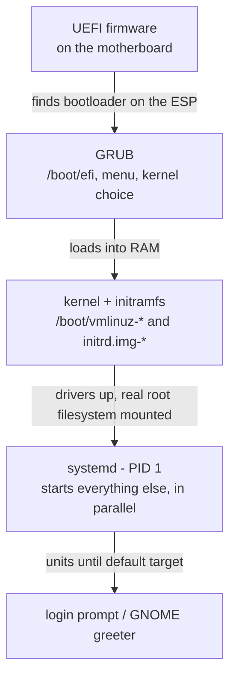

# 1 · From power button to login - the boot chain

> **You'll learn:** the handoffs between power button and login prompt, where each stage lives on disk, and how to measure and read your own machine's boot.

## Why this matters

Boot is where the deepest problems live: the machine that won't start has no shell to debug from, so you reason from the chain itself - *which stage did it die in?* Even on healthy systems, boot knowledge answers daily questions: why kernel updates want a reboot, what that GRUB menu is offering, and where those first two thousand log lines came from.

## The big picture

Four handoffs, each stage finding and starting the next:



Your machine will narrate this to you:

```console
$ cat /proc/cmdline           # the exact arguments GRUB handed the kernel
BOOT_IMAGE=/boot/vmlinuz-7.0.0-14-generic root=UUID=3f1c... ro quiet splash
$ systemd-analyze             # how long did each phase take?
Startup finished in 9.2s (firmware) + 2.1s (loader) + 4.8s (kernel) + 11.3s (userspace) = 27.6s
```

## Stage by stage, on disk

**UEFI firmware** initializes hardware and looks for a bootloader on the **ESP** - the EFI System Partition, a small FAT filesystem mounted at `/boot/efi`. `efibootmgr` lists the firmware's boot menu entries from Linux.

**GRUB** shows the menu (hold `Shift`/`Esc` if it's hidden), lets you pick a kernel - including previous ones, which is your rollback path when a kernel update misbehaves - and loads two files into memory:

```console
$ ls -lh /boot
vmlinuz-7.0.0-14-generic        # the kernel itself (~15 MB of compressed code)
initrd.img-7.0.0-14-generic     # the initramfs (~70-150 MB)
config-7.0.0-14-generic         # build options the kernel was compiled with
grub/                           # menu config - generated, not hand-edited
```

Both files exist per installed kernel version - `apt` keeps a couple of old ones on purpose, and that's what the GRUB menu's "Advanced options" lists.

**The initramfs** solves a bootstrap paradox: the root filesystem might need disk drivers, RAID assembly, or decryption *before* it can be mounted - but drivers and tools live *on* the root filesystem. Answer: a small compressed filesystem-in-a-file, loaded by GRUB into RAM, containing just enough (drivers, `mount`, decryption tooling) to bring the real root online, then hand over and vanish. When you see `update-initramfs` run during kernel upgrades, it's regenerating this survival kit.

**The kernel** unpacks, starts drivers (everything `dmesg` shows with early timestamps), mounts the real root, and starts exactly one userspace program: `/sbin/init` → **systemd, PID 1** - module 4's ancestor of everything, now with its origin story told.

## systemd brings up userspace

From PID 1, systemd starts *units* (next lesson's whole subject) in dependency order, massively in parallel, until it reaches the **default target** - a named milestone:

```console
$ systemctl get-default
graphical.target                 # desktop; servers use multi-user.target
$ systemctl list-dependencies graphical.target --no-pager | head
```

Targets replace the "runlevels" older docs mention. The two you'll meet: `multi-user.target` (everything but the GUI) and `graphical.target` (that plus the display manager). `rescue.target` is the minimal single-user mode for repairs.

## Reading and measuring a boot

Three instruments, all safe to run right now:

```console
$ sudo dmesg | head -20          # the kernel's own log, from timestamp 0.000000
$ systemd-analyze blame | head   # slowest units, worst first
$ systemd-analyze critical-chain # the dependency path that actually gated your boot
```

`blame` is the fun one but read it with care: units start in parallel, so a 8-second entry that overlapped everything else cost you nothing. `critical-chain` shows what actually mattered.

> [!TIP]
> `last reboot | head` reads reboot history from an append-only record - handy for "did this box restart last night?" And `journalctl -b -1` (next lesson but one) shows the *previous* boot's complete log: the black-box recorder for "what happened before it went down".

<details>
<summary>🔍 Deep dive: Secure Boot and the TPM - trust, from silicon up</summary>

Two hardware-rooted features complete the modern chain. **Secure Boot**: UEFI only runs bootloaders signed by a trusted key; Ubuntu's `shim` (signed by Microsoft, whose key ships in every motherboard) verifies GRUB, which verifies the kernel. Every link checks the next - a boot-sector rootkit can't insert itself without breaking a signature. `mokutil --sb-state` reports whether it's on.

**TPM-backed full-disk encryption** - a headline feature of Ubuntu 26.04's installer - uses the Trusted Platform Module chip to hold the disk's decryption key, releasing it only if the *measured* boot chain (hashes of firmware, bootloader, kernel) matches what it sealed against. Result: full encryption without typing a passphrase at boot, and a disk that stays sealed if moved to another machine or booted from a tampered chain. The chain you learned in this lesson is exactly the thing being measured.

</details>

## 🛠️ Try it

Boot archaeology on your own machine - findings into `~/linux-course/exercises/boot.txt`:

1. Reconstruct your last boot's chain: firmware or BIOS (`ls /sys/firmware/efi` - exists = UEFI)? Which kernel (`/proc/cmdline`)? What root device (same line - note it's a UUID)? Total time per phase (`systemd-analyze`)?
2. Inventory `/boot`: how many kernels are installed? Which one are you running (`uname -r`), and is it the newest one on disk? (If not - a reboot is owed; module 5's banner said so too.)
3. Find the three slowest units (`blame`) and the actual gating chain (`critical-chain`). Do they agree on the villain?
4. Read the kernel's first 15 lines ever (`sudo dmesg | head -15`) - find the kernel version banner and the command line echo. Then its *newest* lines (`sudo dmesg | tail -5`) - anything still happening?
5. History: `last reboot | head -5`. When were your last three boots? Cross-check one against `who -b` (time of last boot).
6. Default target: what is it, and list one unit that `graphical.target` pulls in that `multi-user.target` doesn't (`systemctl list-dependencies`, diffed by eye is fine).

<details>
<summary>💡 Hint 1</summary>

Step 2: `ls /boot/vmlinuz-*` vs `uname -r`. Step 6: the display manager (`gdm.service` on stock Ubuntu desktop) is the classic answer.

</details>

<details>
<summary>✅ Solution</summary>

```console
$ ls /sys/firmware/efi > /dev/null && echo UEFI || echo BIOS   # 1
$ cat /proc/cmdline
$ systemd-analyze
$ ls /boot/vmlinuz-* && uname -r                               # 2: running == newest?
$ systemd-analyze blame | head -3                              # 3
$ systemd-analyze critical-chain | head -15
$ sudo dmesg | head -15 && sudo dmesg | tail -5                # 4: tail often shows recent USB/network events
$ last reboot | head -5 && who -b                              # 5
$ systemctl get-default                                        # 6
$ systemctl list-dependencies graphical.target --no-pager | head   # gdm.service stands out
```

</details>

## ✋ Checkpoint

1. Order these and name what each hands to the next: initramfs, UEFI, systemd, GRUB, kernel.
2. A kernel update installed fine but the machine panics on boot. Using only this lesson, what's your recovery move at the keyboard - and why does it work without any rescue USB?
3. Predict: `systemd-analyze blame` shows `network-online.target` at 9s, but your boot only took 11s total and nothing else is near 9s. Contradiction?
4. Why does the initramfs need regenerating (`update-initramfs`) when you change disk encryption settings, but not when you install Firefox?

<details>
<summary>Answers</summary>

1. UEFI (finds and runs the bootloader from the ESP) → GRUB (loads kernel + initramfs into RAM) → kernel (drivers up, uses initramfs to mount real root) → initramfs hands over to → systemd (PID 1, starts all units to the default target).
2. Reboot into GRUB's menu ("Advanced options"), pick the *previous* kernel - apt deliberately keeps it, with its matching initramfs, exactly for this. Then debug from a working system.
3. No - blame measures each unit's own duration, and units run in parallel. The 9s wait overlapped everything else; critical-chain would show it wasn't gating (or that it was - which is why that tool exists).
4. The initramfs's one job is bringing the root filesystem online - decryption tooling is in scope, so its config changes must be baked in. Firefox lives *on* the root filesystem, firmly after the handoff.

</details>

## 📚 Further reading

- `man bootup` - the boot process as systemd documents it, diagram included
- [Ubuntu docs: TPM-backed full disk encryption](https://documentation.ubuntu.com/core/explanation/full-disk-encryption/) - the 26.04 feature in depth

---

⬅️ [Module home](README.md) · 🗺️ [Course map](../README.md) · ➡️ [Next: systemd and services](02-systemd-and-services.md)
