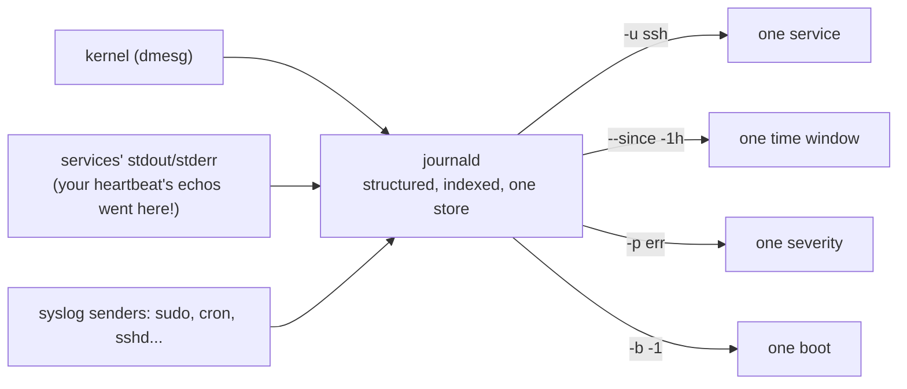

# 3 · journald - one log to rule them all

> **You'll learn:** to find anything in the system journal - filtering by service, time, priority, and boot - and to manage the journal itself.

## Why this matters

When anything misbehaves, the log is where the truth lives - module 1 said so in its very first filesystem tour. On modern Ubuntu, nearly every log converges into one indexed place: the **journal**. Kernel messages, service output, sudo attempts, the OOM killer's confessions - one tool queries it all, and incident response is mostly the art of asking it well.

## The big picture

Everything flows to one collector, and filters slice it:



The four filters in that diagram *are* the skill. Everything else is combination:

```console
$ journalctl -e                        # jump to the end of everything (start here)
$ journalctl -u ssh -e                 # one service's story
$ journalctl -p err -b                 # every error since this boot
$ journalctl -u cron --since "1 hour ago"
$ journalctl -f                        # follow live - tail -f for the whole system
```

## Slicing by service, time, and severity

**By unit** (`-u`) is the daily driver - it's what the status block's log tail was showing you, unabridged. **By time**: `--since`/`--until` accept human phrases and timestamps:

```console
$ journalctl -u ssh --since today
$ journalctl --since "2026-07-09 03:00" --until "2026-07-09 03:30"    # the incident window
$ journalctl --since -15m              # relative: last 15 minutes
```

**By severity**: every entry carries a syslog priority, 0-7. `-p err` means "err *and worse*":

| Level | Name | Reads as |
|---|---|---|
| 0-2 | emerg, alert, crit | the building is on fire |
| 3 | err | something failed |
| 4 | warning | something's off |
| 5-6 | notice, info | normal life |
| 7 | debug | verbose plumbing |

The morning-after triage, in one line: `journalctl -p warning -b` - everything worth an eyebrow since boot.

**By boot** (`-b`) completes lesson 1's promise: `-b` is this boot, `-b -1` the previous one - the black-box recorder for "it crashed overnight". `journalctl --list-boots` shows what's on file, which depends on persistence (below).

## Sharper knives

The journal is *structured* - every entry carries indexed fields, not just text - so filters can be surgical:

```console
$ journalctl SYSLOG_IDENTIFIER=sudo -e     # module 2's audit trail - now you know the machinery
$ journalctl _PID=1247                     # everything one process ever said
$ journalctl -k -e                         # kernel only (= dmesg, but with history)
$ journalctl -k | grep -i "out of memory"  # module 4's OOM killer, caught confessing
$ journalctl -u ssh -o json | head -2      # see the raw structure (every field, JSON per line)
$ journalctl -u ssh -g "Accepted"          # -g: grep built in (PCRE), index-assisted
```

And module 3's toolbox still applies - the journal happily pipes into `grep`, `awk`, and `wc` like everything else.

> [!TIP]
> Building a filter by trial? Add `-e` (end) or `-n 50` (last 50) to every attempt so you're always looking at *recent* matches instead of scrolling 2 GB of history from the top. Then drop the training wheels for the real query.

## Managing the journal itself

The journal lives in `/var/log/journal/` (persistent across boots - Ubuntu's default when that directory exists), self-rotates, and self-caps:

```console
$ journalctl --disk-usage                       # how much history am I keeping?
$ sudo journalctl --vacuum-time=30d             # trim to 30 days
$ sudo journalctl --vacuum-size=500M            # or to a size budget
```

Config lives in `/etc/systemd/journald.conf` (`SystemMaxUse=` is the cap - drop-ins via `/etc/systemd/journald.conf.d/`, same override etiquette as lesson 2).

Meanwhile `/var/log` still holds classic text files - some services write their own (`nginx/access.log`), dpkg keeps `dpkg.log`, and **logrotate** (config in `/etc/logrotate.d/`) compresses and ages those the old way. That's why module 1 found `syslog` there, and why module 2's deleted-but-open log-file trap exists. The journal didn't delete the old world; it federated it.

<details>
<summary>🔍 Deep dive: why binary logs - the tradeoff journald made</summary>

Old-school syslog wrote plain text lines: greppable with cat alone, readable forever, but unindexed (every query is a full scan), trivially forgeable (any process could write a line claiming to be sshd), and unstructured (parsing timestamps out of freeform text is a cottage industry of regret).

journald stores binary, append-only files where each entry's fields are indexed - and crucially, fields like `_PID`, `_UID`, and `_SYSTEMD_UNIT` are stamped *by journald from the kernel's own knowledge* of the sender, not self-reported. `journalctl SYSLOG_IDENTIFIER=sudo` can be lied to by a malicious process; `journalctl _COMM=sudo` much less so. The costs: you need `journalctl` (or the JSON export) to read your own logs, and corruption of a journal file is uglier than corruption of a text file. The `-o json` and `-o export` outputs - and forwarding to a classic syslog daemon, which Ubuntu supports - are the escape hatches that made the tradeoff acceptable.

Membership note: full journal access belongs to the `adm` and `systemd-journal` groups - module 2's lesson 1 exercise met exactly this wall when the lab user couldn't read the logs.

</details>

## 🛠️ Try it

Interrogation practice - queries and findings into `~/linux-course/exercises/journal.txt`:

1. Triage your machine like it's not yours: `journalctl -p err -b`. How many entries, and what's the worst-looking one? (Desktop Ubuntu always has *some* - a benign firmware grumble is a classic.)
2. Watch yourself arrive: in one terminal `journalctl -f`, in another run `sudo -k && sudo true` with a deliberately wrong password once, then the right one. Find both events in the stream (module 2's audit trail, live).
3. Resurrect the heartbeat service from lesson 2 for five minutes (or reuse any service): where did its `echo` output go? Prove it with `-u heartbeat` and note the *timestamps* arrived free of charge.
4. Boot archaeology: `journalctl --list-boots`, then from the previous boot (`-b -1`) find the very last 10 lines before shutdown. What was the system doing in its final second?
5. Kernel-only sweep: any USB devices connected since boot (`journalctl -k -g -i usb -n 20`)? Any OOM kills ever (`-g -i "out of memory"`)? Silence on the second is the good answer.
6. Housekeeping: current `--disk-usage`, then vacuum to a size that keeps ~2 weeks (your judgment from the usage number), and re-check. Note before/after.

<details>
<summary>💡 Hint 1</summary>

Step 2: the failed attempt logs as `pam_unix(sudo:auth): authentication failure` plus sudo's own `incorrect password attempt`; the success as module 2's familiar `COMMAND=` line. Step 4: `journalctl -b -1 -n 10`.

</details>

<details>
<summary>✅ Solution</summary>

```console
$ journalctl -p err -b | wc -l                       # 1: count varies; read the worst with -e
$ journalctl -f                                      # 2: terminal A
$ sudo -k && sudo true                               #    terminal B: fail once, then succeed
                                                     #    A shows: authentication failure → COMMAND=/usr/bin/true
$ sudo systemctl start heartbeat                     # 3 (if you kept the unit; else skip)
$ journalctl -u heartbeat -n 5                       #    "heartbeat Thu Jul 10 ..." - echoes became logs
$ sudo systemctl stop heartbeat
$ journalctl --list-boots | tail -3                  # 4
$ journalctl -b -1 -n 10                             #    systemd stopping targets, journald's own farewell
$ journalctl -k -g -i usb -n 20                      # 5
$ journalctl -k -g -i "out of memory" || echo none   #    none = healthy
$ journalctl --disk-usage                            # 6
$ sudo journalctl --vacuum-time=14d && journalctl --disk-usage
```

</details>

## ✋ Checkpoint

1. Compose it cold: every *error or worse* from the ssh service in the last 24 hours. One command.
2. A service crashed at 03:12 last night and the machine has since rebooted. Two flags team up to reach the evidence - which two?
3. Predict: your script `echo`s a warning and exits; it runs as a systemd service. Where does the warning end up, and with how much effort on your part?
4. From the deep dive: why is filtering on `_UID=0` more trustworthy than grepping messages for the word "root"?

<details>
<summary>Answers</summary>

1. `journalctl -u ssh -p err --since "24 hours ago"` (or `--since -24h`).
2. `-b -1` (previous boot) narrowed with `--since`/`--until` around 03:12 - or `-b -1 -u <service> -e` and scroll; the boot selector is the non-negotiable half.
3. In the journal, under the service's unit, timestamped and priority-tagged - for zero effort. stdout/stderr capture is the deal systemd made with lesson 2's `nohup`-free world.
4. `_UID` is stamped by journald from the kernel's socket credentials of the *actual sender* - unforgeable by the process. Message text is whatever the sender chose to print, including lies.

</details>

## 📚 Further reading

- `man journalctl` - skim the matches/filters section; the tool is deeper than any lesson
- `man systemd-journald` and `man journald.conf` - retention, rate limiting, forwarding
- [systemd journal fields](https://www.freedesktop.org/software/systemd/man/latest/systemd.journal-fields.html) - every `_UNDERSCORE` field explained

---

⬅️ [Previous: systemd and services](02-systemd-and-services.md) · 🗺️ [Course map](../README.md) · ➡️ [Next: Timers and cron](04-timers-and-cron.md)
