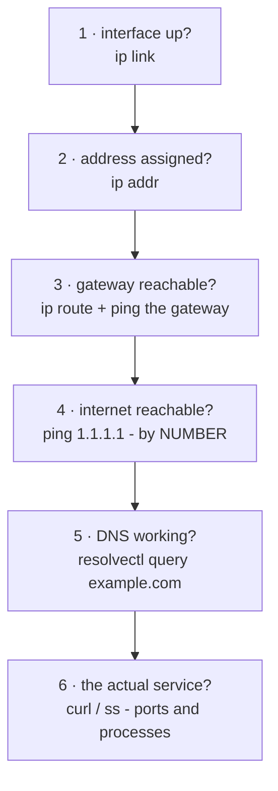

# 1 · The network stack - ip, ss, and debugging connectivity

> **You'll learn:** to inspect every layer of your machine's networking - interfaces, addresses, routes, DNS, ports - and to walk "the internet is down" like a ladder instead of a mystery.

## Why this matters

"It can't connect" is the most common complaint in computing, and it always has a *layer*: cable/wifi, address, route, name resolution, or the service itself. Guessers reboot things at random; professionals test one layer at a time, bottom up, and find it in five commands. This lesson is those five commands.

## The big picture

The debugging ladder - each rung assumes the ones below it:



The genius move is rung 4 vs 5: `ping 1.1.1.1` working while `ping example.com` fails cleaves the problem in half - the network is fine, *name resolution* is broken. Half of all "internet down" tickets die right there.

## Interfaces, addresses, routes: the ip command

`ip` (the modern replacement for the `ifconfig` of older tutorials) reads and writes the kernel's network state - module 3's `/sys/class/net` listing, now with its proper tool:

```console
$ ip -br link                  # -br: brief. every interface + up/down
lo      UNKNOWN  00:00:00:00:00:00
enp3s0  UP       a8:5e:45:...           # ethernet; wifi shows as wlp2s0-ish
$ ip -br addr                  # addresses per interface
lo      UNKNOWN  127.0.0.1/8 ::1/128
enp3s0  UP       192.168.1.42/24 fe80::.../64
$ ip route                     # where do packets go?
default via 192.168.1.1 dev enp3s0     # ← the gateway: your door to everywhere
192.168.1.0/24 dev enp3s0 ...          # ← the local network: direct delivery
```

Reading `192.168.1.42/24`: the `/24` means the first 24 bits (192.168.1) name the *network*; anything matching it is a neighbour reached directly, everything else goes `via` the default gateway. `lo` is loopback - the machine talking to itself at `127.0.0.1` (localhost), essential and always there.

`ping` tests reachability rung by rung: `ping -c3 192.168.1.1` (my gateway), `ping -c3 1.1.1.1` (the world, by number).

## Names: DNS and systemd-resolved

Humans type `example.com`; packets need `96.7.128.175`. On Ubuntu, **systemd-resolved** does the translating, and module 2's mysterious symlink finally confesses:

```console
$ ls -l /etc/resolv.conf                      # → ../run/systemd/resolve/stub-resolv.conf
$ cat /etc/resolv.conf | grep nameserver
nameserver 127.0.0.53                         # resolved's local stub - all queries go here
$ resolvectl status | head -12                # which REAL DNS servers is it using, per interface?
$ resolvectl query example.com                # translate a name, and see which server answered
example.com: 96.7.128.175
```

For heavier lifting, `dig example.com` (from `bind9-dnsutils`) shows the full DNS conversation - records, TTLs, timing. When rung 5 fails, `resolvectl status` tells you *which* DNS server the machine is trusting, which is usually where the story is.

## Ports: who's listening?

Services await connections on numbered **ports** (ssh 22, HTTP 80, HTTPS 443). `ss` lists sockets - and with module 2's sudo, which *process* owns each:

```console
$ sudo ss -tlnp                # Tcp, Listening, Numeric, Processes
State   Local Address:Port   Process
LISTEN  0.0.0.0:22           users:(("sshd",pid=1247,fd=3))
LISTEN  127.0.0.53%lo:53     users:(("systemd-resolve",pid=812,fd=18))
```

Read each line as a doorbell: sshd answers port 22 *on every address* (`0.0.0.0`); resolved answers 53 *only on localhost* - it's the stub from the last section, and the address scoping is a security posture you can now read. The classic uses: "is my service actually up?" and "what is squatting on port 8080?" (`ss -tlnp | grep 8080`). For the client side of layer 7, `curl -I https://example.com` fetches just the response headers - proof the whole ladder works end to end.

## Configuration: netplan

Everything above *inspected*; persistent configuration on Ubuntu is **netplan** - YAML in `/etc/netplan/`, rendered onto systemd-networkd (servers) or NetworkManager (desktops):

```console
$ ls /etc/netplan/ && sudo cat /etc/netplan/*.yaml
network:
  version: 2
  ethernets:
    enp3s0:
      dhcp4: true              # desktop default: ask the router for everything
```

A static-address server version swaps `dhcp4: true` for `addresses: [192.168.1.50/24]`, a `routes:` entry for the gateway, and `nameservers:`. The apply step has a seatbelt built for remote machines:

```console
$ sudo netplan try             # applies, then REVERTS in 120s unless you confirm
$ sudo netplan apply           # the no-seatbelt version
```

> [!WARNING]
> `netplan try` exists because a bad network config on a remote machine is a sawed-off branch you were sitting on. Use try whenever the machine is further away than your desk.

<details>
<summary>🔍 Deep dive: the full journey of one curl</summary>

`curl https://example.com` - everything this course has built, in half a second:

1. curl calls `getaddrinfo()` → glibc consults `/etc/nsswitch.conf` → asks resolved's stub at 127.0.0.53 → cache miss → resolved queries the real DNS server from `resolvectl status` → `96.7.128.175` comes back (module 4 could strace every step of this).
2. curl asks the kernel for a TCP connection: `socket()`, then `connect()` to 96.7.128.175:443 - syscalls, module 4's boundary. The kernel consults `ip route`, picks the default gateway, and hands the first packet to `enp3s0`.
3. Three packets shake hands (SYN, SYN-ACK, ACK) - TCP's reliability contract begins.
4. TLS negotiates: certificates verified against `/usr/share/ca-certificates/` - a trust store on your disk, exactly like module 5's apt keyrings, solving the same problem for the web.
5. HTTP at last: `GET / HTTP/2` down the encrypted pipe, HTML back up, kernel → socket → curl's stdout → module 3's pipes if you want them.

Six subsystems, five course modules, one command. When any step fails, the ladder tells you which - and now you know what each rung is actually made of.

</details>

## 🛠️ Try it

Climb the ladder on your own machine - findings into `~/linux-course/exercises/network.txt`:

1. Full inventory: your interfaces and states (`ip -br link`), your address and network size (`ip -br addr`), your gateway (`ip route`). Write the three facts as a sentence: "I am ADDRESS on network NET, exiting via GW."
2. Climb rungs 3-6 in order: ping your gateway, ping 1.1.1.1, resolve example.com, `curl -I https://example.com`. Note the round-trip times as you go - LAN vs internet.
3. Who's listening on your machine (`sudo ss -tlnp`)? For each line: which process, and is it exposed to the network (`0.0.0.0`/`[::]`) or localhost-only (`127.0.0.1`)? Any surprises deserve a note.
4. DNS spelunking: which real DNS servers is resolved using (`resolvectl status`)? Query the same name twice with `resolvectl query` - any hint the second was cached (`dig example.com` shows the TTL story clearly if you have it)?
5. Read (don't change) your netplan: DHCP or static? Which renderer (or is it absent, meaning the default)?
6. Break-glass drill, on paper only: for each failure, name the rung and the command that would prove it - (a) wifi icon shows connected but *nothing* loads, even 1.1.1.1; (b) `ping 1.1.1.1` works but no website resolves; (c) websites work but a colleague can't reach the dev server you're running on port 3000.

<details>
<summary>💡 Hint 1</summary>

Step 6c: is the dev server listening on 127.0.0.1 (only you) or 0.0.0.0 (the network)? `ss -tlnp | grep 3000` settles it - the most common "works for me" in web development.

</details>

<details>
<summary>✅ Solution</summary>

```console
$ ip -br link && ip -br addr && ip route          # 1
$ ping -c3 192.168.1.1 && ping -c3 1.1.1.1        # 2: ~1-5ms LAN, ~5-30ms internet
$ resolvectl query example.com && curl -I https://example.com
$ sudo ss -tlnp                                   # 3: sshd? cups on 631? resolved on 53?
$ resolvectl status | grep -A3 "DNS Servers"      # 4
$ sudo cat /etc/netplan/*.yaml                    # 5
```

Step 6: (a) rung 2-3 - address/gateway; `ip -br addr` (a 169.254.x.x address means DHCP failed). (b) rung 5 - DNS; `resolvectl status`, then try `resolvectl query` against a known server. (c) rung 6 - the service is bound to localhost; `ss -tlnp | grep 3000` shows `127.0.0.1:3000`, and the fix is binding 0.0.0.0 (plus firewall, if enabled).

</details>

## ✋ Checkpoint

1. `ping 1.1.1.1` succeeds; `ping example.com` says "Temporary failure in name resolution". State the diagnosis in five words and the next command.
2. Predict: `sudo ss -tlnp` shows your database listening on `127.0.0.1:5432`. Can the machine next to you connect to it? Is that a bug?
3. Why does editing `/etc/resolv.conf` by hand not survive on Ubuntu, and what are the two legitimate places DNS servers get configured? (Two modules answer jointly.)
4. You're about to change the netplan of a server in another city. Which command, and what happens if your new config cuts you off?

<details>
<summary>Answers</summary>

1. "Network fine, DNS is broken" - `resolvectl status` to see which server is failing you.
2. No - it only answers loopback. Almost certainly deliberate security posture (databases default to localhost precisely so the network can't reach them); the "fix", if genuinely wanted, is config plus a firewall thought.
3. It's a symlink into `/run`, regenerated by systemd-resolved (module 2 taught the symlink, this lesson the owner). Legitimate config: netplan's `nameservers:` key, or per-interface via NetworkManager - both feed resolved.
4. `sudo netplan try` - if the config severs your ssh session, you can't confirm within 120 seconds, and it rolls itself back. The sawed branch reattaches.

</details>

## 📚 Further reading

- `man ip` (and `ip route help`) - terse but complete; the `-br` flag is life-changing
- [netplan.io examples](https://netplan.io/examples) - every common config, ready to adapt
- `man systemd-resolved` - caching, DNSSEC, split DNS, and the stub explained by its author

---

⬅️ [Module home](README.md) · 🗺️ [Course map](../README.md) · ➡️ [Next: SSH - remote work done right](02-ssh.md)
