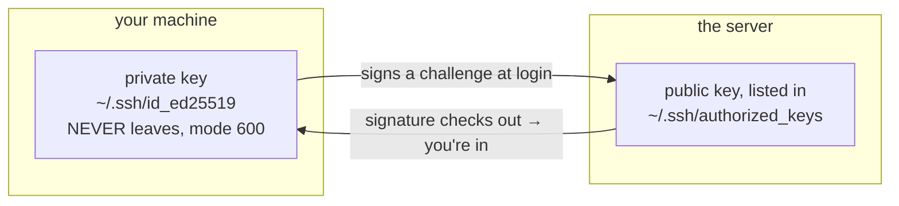

# 2 · SSH - remote work done right

> **You'll learn:** to work on remote machines as fluently as your own - key-based logins, a config file that remembers the details, and file transfer with scp and rsync.

## Why this matters

Nearly every Linux machine that matters is somewhere else - the server, the VPS, the Pi in the cupboard - and SSH is the door to all of them. Everything this course taught works identically over SSH (it's just your shell, elsewhere - module 1 promised this). Doing SSH *well* - keys instead of passwords, config instead of memory - is the difference between remote work feeling native and feeling like dialing a modem.

## The big picture

```console
$ ssh steve@server.example.com      # a shell, there. exit to come home.
```

Passwords over ssh are guessable, phishable, and tedious. **Key pairs** replace them: a private key that never leaves your machine, a public key you hand out freely:



The server challenges; your private key signs; the signature proves you hold the key without revealing it. No secret crosses the wire - which is why it beats any password ever typed.

## Keys in three commands

```console
$ ssh-keygen -t ed25519                     # generate the pair (accept the default path;
                                            #  DO set a passphrase - it encrypts the private key on disk)
$ ssh-copy-id steve@server                  # append your .pub to the server's authorized_keys
                                            #  (asks for the password - the last time you'll type it)
$ ssh steve@server                          # key auth from here on
```

What ssh-copy-id did is no mystery now: it appended one line of `~/.ssh/id_ed25519.pub` to the server's `~/.ssh/authorized_keys` - a file you can read, audit, and prune with module 1 skills. And the permissions matter enough that ssh *enforces* them: `~/.ssh` at 700, keys at 600 - module 2's chmod, load-bearing.

First-ever connection to any host, you'll get the fingerprint prompt (`The authenticity of host ... can't be established`). That's **trust-on-first-use**: accept, and the host's key is pinned in `~/.ssh/known_hosts`; if that host's key ever *changes*, ssh screams and refuses - the alarm for either a reinstalled server or someone impersonating it. Don't train yourself to ignore it.

## ~/.ssh/config: never memorize again

```text
# ~/.ssh/config
Host web
    HostName 203.0.113.10
    User deploy
    Port 2222

Host pi
    HostName 192.168.1.80
    User steve
```

```console
$ ssh web                    # = ssh -p 2222 deploy@203.0.113.10
$ scp report.pdf pi:         # aliases work in every ssh-family tool
```

Every ssh option has a config spelling (`man ssh_config`), `Host *` sets defaults for everywhere, and the file grows into a personal address book of your infrastructure. This one file is the highest-leverage quality-of-life upgrade in the whole module.

## Moving files: scp and rsync

```console
$ scp notes.txt web:                          # file → home dir on web
$ scp web:/var/log/app.log ./logs/            # remote → local
$ scp -r project/ web:apps/                   # directories with -r
```

`scp` is fine for a file. For directories, repeat transfers, or anything big, **rsync** is the professional tool - it sends only what changed:

```console
$ rsync -av --dry-run project/ web:apps/project/    # ALWAYS rehearse first (-n works too)
$ rsync -av project/ web:apps/project/              # -a: preserve everything; -v: narrate
$ rsync -av --delete project/ web:apps/project/     # true mirror: also remove strays (respect it)
```

> [!WARNING]
> rsync's one gotcha is the trailing slash: `project/` means *the contents of* project; `project` means *the directory itself* (you'd get `apps/project/project/`). The `--dry-run` habit exists because of exactly this - and it's the same rehearse-before-destroying instinct as module 1's `echo *.txt`.

Two more doors the same keys open: `ssh web 'df -h'` runs one command and returns (scriptable - your module 3 skills go remote), and for long jobs, start them inside `tmux` on the server (`tmux` → run → detach `Ctrl+B d` → `tmux attach` later) - the modern answer to module 4's nohup, surviving disconnects with your whole session intact.

<details>
<summary>🔍 Deep dive: hardening sshd - the server's side of the deal</summary>

Anything listening on port 22 gets hammered by bots within minutes of existing. The standard hardening, all in `/etc/ssh/sshd_config` (or better, a drop-in in `sshd_config.d/` - module 6's override etiquette, same idea):

```text
PasswordAuthentication no        # keys only - kills the entire guessing game
PermitRootLogin no               # admins log in as themselves, then sudo (module 2's whole thesis)
```

Then `sudo systemctl reload ssh` (module 6: reload, not restart - existing sessions live). **Order of operations is everything**: confirm key login works in a *second terminal* before disabling passwords in the first - the classic self-lockout is doing it backwards. `journalctl -u ssh -f` afterwards is grimly educational: watch the bots fail against keys they can't guess. Fail2ban and non-standard ports reduce the noise; keys are what provide the safety.

</details>

## 🛠️ Try it

No second machine needed - Ubuntu can ssh to itself, and the lab user from module 2 makes a fine "remote" account:

1. Server up: `sudo apt install openssh-server`, then module 6 pre-flight: is `ssh.service` active and enabled? Is it listening (lesson 1's `ss`)?
2. `ssh localhost` - meet trust-on-first-use, accept, and find the new pinned line in `~/.ssh/known_hosts`. Then `exit` (check the hostname in your prompt to know where you are - it's the same machine, which is the joke and the lesson).
3. Keys: `ssh-keygen -t ed25519` (passphrase on), recreate the lab user if needed (`sudo adduser lab`), then `ssh-copy-id lab@localhost`. Log in - passwordless (after the passphrase) - and `cat ~/.ssh/authorized_keys` *as lab* to see exactly what got installed. Check its permissions while there.
4. Config: add a `Host labbox` entry (HostName localhost, User lab) and prove `ssh labbox` works.
5. rsync drill with the trailing-slash trap sprung on purpose: `rsync -av ~/linux-course labbox:backup/` vs `~/linux-course/ labbox:backup2/` - dry-run both, predict the difference, run one for real, verify as lab.
6. One-liner remote admin: from your account, `ssh labbox 'df -h | head -3'`. Then cleanup per module 2's README: `sudo deluser --remove-home lab` when the module's done with it.

<details>
<summary>💡 Hint 1</summary>

Step 3: if `ssh-copy-id` complains about password auth, lab needs a password set (`sudo passwd lab`). Step 5: version 1 creates `backup/linux-course/...`; version 2 puts the *contents* directly in `backup2/`.

</details>

<details>
<summary>✅ Solution</summary>

```console
$ sudo apt install openssh-server                     # 1
$ systemctl is-active ssh && systemctl is-enabled ssh
$ sudo ss -tlnp | grep :22                            # sshd on 0.0.0.0:22
$ ssh localhost                                       # 2: fingerprint → yes → shell → exit
$ tail -1 ~/.ssh/known_hosts
$ ssh-keygen -t ed25519                               # 3
$ sudo adduser lab                                    # (if module 2's cleanup already ran)
$ ssh-copy-id lab@localhost && ssh lab@localhost
lab$ cat ~/.ssh/authorized_keys && ls -la ~/.ssh      # your key; dir 700, file 600
lab$ exit
$ printf 'Host labbox\n    HostName localhost\n    User lab\n' >> ~/.ssh/config    # 4
$ ssh labbox 'echo it works'
$ rsync -avn ~/linux-course labbox:backup/            # 5: dry-runs first - spot the paths
$ rsync -avn ~/linux-course/ labbox:backup2/
$ rsync -av ~/linux-course labbox:backup/
$ ssh labbox 'ls backup'                              # linux-course (the dir itself)
$ ssh labbox 'df -h | head -3'                        # 6
```

</details>

## ✋ Checkpoint

1. In the key handshake, exactly what crosses the network - and why does that make keys immune to the server itself being malicious and password-hungry?
2. ssh suddenly refuses a host with `WARNING: REMOTE HOST IDENTIFICATION HAS CHANGED`. Give one innocent and one sinister explanation, and the *wrong* reflex.
3. Predict: you `ssh-copy-id` to a server, it works, then the admin sets `PasswordAuthentication no`. Can you still get in? Can a new teammate without keys?
4. You must mirror `/var/www/site/` to a standby server nightly, deletions included. Compose the rsync (rehearsal flag included), then name which module 6 tool schedules it.

<details>
<summary>Answers</summary>

1. Only the public key's identity and a *signature* over a fresh challenge - never the private key or any reusable secret. A malicious server learns nothing it can replay; a phished password is game over.
2. Innocent: the server was reinstalled/re-keyed. Sinister: something between you and it is impersonating it. Wrong reflex: deleting the known_hosts line without asking which - verify the new fingerprint out-of-band first.
3. You: yes - keys are exactly what remains enabled. New teammate: no password path exists; someone with access must install their public key (or they hand the admin their .pub - never the private one).
4. `rsync -av --delete --dry-run /var/www/site/ standby:/var/www/site/` - trailing slashes on both, rehearse, then drop the dry-run into a script run by a systemd timer with `Persistent=true`.

</details>

## 📚 Further reading

- `man ssh_config` and `man sshd_config` - both sides' full option catalogues
- [Ubuntu Server docs: OpenSSH](https://documentation.ubuntu.com/server/how-to/security/openssh-server/) - setup and hardening, Canonical's way
- `man tmux` - or any "tmux in 10 minutes" tutorial; your future ssh sessions deserve it

---

⬅️ [Previous: The network stack](01-the-network-stack.md) · 🗺️ [Course map](../README.md) · ➡️ [Next: Disks and filesystems](03-disks-and-filesystems.md)
