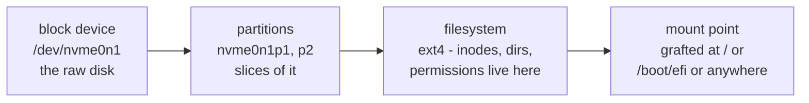

# 3 · Disks and filesystems - block devices, mounts, fstab

> **You'll learn:** the chain from physical disk to visible directory - block devices, partitions, filesystems, mounts - and how to build and mount a filesystem yourself, safely.

## Why this matters

Module 1 said Linux has one tree, no drive letters - this lesson reveals the machinery behind that elegance: disks *grafted* onto the tree at mount points. It's what you need the day you add a disk, rescue a USB stick, read an fstab someone else wrote, or wonder why `/boot/efi` shows up in df. And you'll practice it with zero risk, on a disk made of a file.

## The big picture

Four layers, each visible with one command:



```console
$ lsblk                        # the whole chain, as a tree
NAME        MAJ:MIN RM   SIZE RO TYPE MOUNTPOINTS
nvme0n1     259:0    0 476.9G  0 disk
├─nvme0n1p1 259:1    0     1G  0 part /boot/efi      ← module 6's ESP!
└─nvme0n1p2 259:2    0 475.9G  0 part /
sda           8:0    1  28.9G  0 disk                ← a USB stick (RM=1: removable)
└─sda1        8:1    1  28.9G  0 part /media/steve/USB
```

Read your machine's story right off it: one NVMe disk, GPT-partitioned into the EFI partition (module 6's boot chain, on disk) and the root filesystem. Everything else in this lesson is those four layers, one at a time.

## Block devices and partitions

A **block device** is anything the kernel can read/write in fixed-size chunks - and true to module 1's creed, each is a file: `/dev/nvme0n1` (NVMe SSD), `/dev/sda` (SATA/USB), and their numbered **partitions** (`p1`, `sda1`). Partitions exist because one disk usually serves several masters - firmware demands a FAT-formatted ESP, Linux wants ext4, and the **GPT** partition table at the disk's start records the slicing (`sudo fdisk -l /dev/nvme0n1` prints it; fdisk also *edits* it, which is not today's lab).

`blkid` adds the detail that matters for later:

```console
$ sudo blkid /dev/nvme0n1p2
/dev/nvme0n1p2: UUID="3f1c9a72-..." TYPE="ext4" ...
```

That UUID is the partition's permanent name - remember module 6's `root=UUID=...` kernel argument? Device names like `sda` are *assigned in detection order* and shuffle when hardware changes; UUIDs never lie. This becomes load-bearing at fstab time.

## Filesystems: what formatting actually installs

A raw partition is a featureless run of blocks. A **filesystem** imposes the world this course has lived in: inodes (module 2's lesson 4, finally at home), directories, permissions, timestamps. `mkfs` writes those structures - "formatting":

```console
$ sudo mkfs.ext4 /dev/sdX1        # ⚠ THE destructive command of this module -
                                  #   whatever was on sdX1 is gone. Triple-check with lsblk first.
```

| Filesystem | Where you'll meet it |
|---|---|
| **ext4** | Ubuntu's default - solid, journaled, boring in the best way |
| vfat/exFAT | the ESP; USB sticks that must also work on Windows/macOS |
| ntfs | Windows disks (Linux reads/writes fine) |
| btrfs/zfs/xfs | snapshots, checksums, huge arrays - the ambitious tier |
| squashfs | module 5's snaps - read-only, compressed |

The **journal** in "journaled": ext4 notes each metadata change in a log before making it, so a power cut mid-write replays or discards cleanly at next mount - why unclean shutdowns no longer mean filesystem roulette.

## Mounting: grafting onto the tree

```console
$ sudo mount /dev/sda1 /mnt            # graft: sda1's contents now appear at /mnt
$ findmnt /mnt                         # verify (findmnt with no args: the whole mount tree)
$ sudo umount /mnt                     # detach - fails with "target is busy" if anything
                                       #   holds a file open (module 4 taught you who: lsof /mnt)
```

Anything can be a mount point - an empty directory is customary (mounting *shadows* whatever was in it until umount). The desktop automounts USB sticks under `/media/$USER/`; servers and admins mount by hand or by fstab. The "safely remove" ritual is just umount - it flushes the write cache, and yanking a stick before it is how files evaporate.

**`/etc/fstab`** is the boot-time mount list - one line per filesystem, and now every field reads:

```text
# device                                    mountpoint  type  options    dump pass
UUID=3f1c9a72-...                           /           ext4  defaults   0    1
UUID=A1B2-C3D4                              /boot/efi   vfat  umask=0077 0    1
```

UUIDs for the reason above; options usually `defaults`; pass orders fsck at boot. On 26.04, systemd translates each line into `.mount` units (module 6's unit table had that row waiting). The classic trap: a typo'd fstab can drop boot into emergency mode - `sudo findmnt --verify` checks the file *before* the reboot does, and the `nofail` option marks a disk as skippable-if-absent.

<details>
<summary>🔍 Deep dive: one tree, many sources - the mount namespace in full</summary>

`findmnt` on a desktop lists dozens of mounts, most not disks at all: `/proc` and `/sys` (module 4's kernel windows - *mounted*, like everything else), `tmpfs` at `/run` and `/tmp` (filesystems living in RAM - fast, gone at poweroff), squashfs loops per snap, cgroup and pstore plumbing. The lesson generalizes: *mounting* is how any source of file-shaped data - disk, RAM, kernel, network share (NFS/SMB), fuse gadget - gets an address in the one tree. "Everything is a file" works because everything can be mounted.

Two power moves from this view: `mount -o bind /a /b` grafts an existing *directory* at a second location (containers lean on this heavily), and `systemd.automount` units mount lazily on first access - why a dead NFS server needn't hang your boot.

</details>

## 🛠️ Try it

The loop-disk lab: a real filesystem lifecycle on a disk made of a file - genuinely zero-risk:

1. Survey first: `lsblk` and `findmnt` on your machine. Identify your root device, the ESP, and (bonus) count the snap squashfs mounts.
2. Manufacture a disk: `truncate -s 200M ~/lab-disk.img` (a 200 MB file of nothing). Check with `ls -lh` - and `du -h ~/lab-disk.img` for a sparse-file surprise worth a note.
3. Format it: `sudo mkfs.ext4 ~/lab-disk.img` (mkfs works on files directly - a "loop mount" bridges the rest). Read mkfs's chatty output: find the inode count it just created (module 2, manufactured before your eyes).
4. Mount it: `sudo mkdir -p /mnt/lab && sudo mount -o loop ~/lab-disk.img /mnt/lab`. Confirm with `lsblk` (a new `loop` device!) and `findmnt /mnt/lab`. Note the `lost+found` - every fresh ext4 has one.
5. Live on it: fix ownership (`sudo chown $USER: /mnt/lab` - module 2 in the wild), copy your `~/linux-course` onto it, `df -h /mnt/lab`.
6. The busy-umount rite of passage: `cd /mnt/lab`, try `sudo umount /mnt/lab`, read the error, diagnose with `lsof /mnt/lab` (it's you), `cd ~`, umount clean. Then remount it and read your files - still there, of course: that's the point of a filesystem.
7. Cleanup: umount, `rm ~/lab-disk.img`, rmdir the mount point. Write the four layers from the big picture into `~/linux-course/exercises/disks.txt`, each with the command that inspects it.

<details>
<summary>💡 Hint 1</summary>

Step 2's surprise: `ls` says 200M (the file's *length*), `du` says ~0 (blocks actually allocated) - a sparse file, and a preview of next lesson's df-vs-du theme. Step 6: the error is `target is busy`; your shell's cwd counts as "using it" (module 4: every process has a cwd - you saw it in /proc).

</details>

<details>
<summary>✅ Solution</summary>

```console
$ lsblk && findmnt | head -20                          # 1
$ truncate -s 200M ~/lab-disk.img
$ ls -lh ~/lab-disk.img && du -h ~/lab-disk.img        # 2: 200M vs 0 - sparse
$ sudo mkfs.ext4 ~/lab-disk.img                        # 3: "51200 inodes, 204800 blocks..."
$ sudo mkdir -p /mnt/lab && sudo mount -o loop ~/lab-disk.img /mnt/lab
$ lsblk | grep loop | tail -3 && findmnt /mnt/lab      # 4: /dev/loopN appeared
$ sudo chown $USER: /mnt/lab                           # 5
$ cp -r ~/linux-course /mnt/lab/ && df -h /mnt/lab
$ cd /mnt/lab && sudo umount /mnt/lab                  # 6: umount: /mnt/lab: target is busy.
$ lsof /mnt/lab                                        # bash, cwd - it's you
$ cd ~ && sudo umount /mnt/lab
$ sudo mount -o loop ~/lab-disk.img /mnt/lab && ls /mnt/lab   # persistence proven
$ sudo umount /mnt/lab && rm ~/lab-disk.img && sudo rmdir /mnt/lab   # 7
```

</details>

## ✋ Checkpoint

1. Recite the four layers for a USB stick that shows as `sdb` with one partition, currently readable at `/media/steve/STICK` - device, partition, filesystem (likely type?), mount point.
2. Why does fstab use `UUID=` instead of `/dev/sdb1`, concretely - what goes wrong with the device name the day you plug in a second disk?
3. Predict: `sudo umount /media/steve/STICK` fails, "target is busy", but you have no terminal anywhere near it. Name two other kinds of culprit and the command that unmasks them.
4. A colleague edits fstab, doesn't verify, reboots, and the server drops to emergency mode. Which command would have caught it beforehand, and which option would have made the entry non-fatal?

<details>
<summary>Answers</summary>

1. `/dev/sdb` (block device) → `/dev/sdb1` (partition) → vfat or exFAT, typically, for a stick (filesystem) → `/media/steve/STICK` (mount point).
2. Names are detection-order: with a second disk present, yesterday's `sdb` may enumerate as `sdc`, and fstab now mounts the *wrong device* or fails. The UUID lives in the filesystem itself and moves with it.
3. A file manager window sitting in the directory, or any process with a file open there (a paused video, an editor's open file). `lsof /media/steve/STICK` (or `fuser -vm`) names names.
4. `sudo findmnt --verify` parses and sanity-checks fstab without rebooting; `nofail` in the options column lets boot continue when that filesystem can't mount.

</details>

## 📚 Further reading

- `man lsblk`, `man findmnt` - the two inspection tools' full powers
- `man fstab` - every field, formally (a section-5 page, as module 1 taught you to expect)
- [Ubuntu Server docs: storage](https://documentation.ubuntu.com/server/explanation/storage/about-lvm/) - bridges directly into the next lesson

---

⬅️ [Previous: SSH](02-ssh.md) · 🗺️ [Course map](../README.md) · ➡️ [Next: Space and growth](04-space-and-growth.md)
