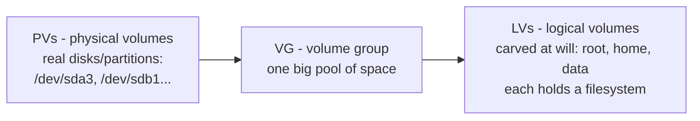

# 4 · Space and growth - df, du, and LVM basics

> **You'll learn:** to answer "why is the disk full and what do I delete?" methodically - and how LVM lets storage grow without reinstalling anything.

## Why this matters

"No space left on device" stops databases, breaks boots, and corrupts writes mid-flight - and it always happens at the worst time. The full-disk investigation is a repeatable five-minute procedure, not an archaeology project, and this final lesson also hands you the grown-up tool (LVM) that makes "add more space" a live operation.

## The big picture

Two tools, two questions - and the difference between them *is* the method:

```console
$ df -h                        # per FILESYSTEM: how full is each tank?
Filesystem      Size  Used Avail Use% Mounted on
/dev/nvme0n1p2  468G  431G   14G  97% /          ← the emergency
$ sudo du -xh --max-depth=1 / 2>/dev/null | sort -rh | head    # per DIRECTORY: where inside?
195G  /home
121G  /var
 89G  /usr
```

**df** reads each filesystem's own accounting - instant, and the truth about fullness. **du** walks directories adding up file sizes - slower, and the map of *where*. The procedure: df finds the sick filesystem, du (drilling down level by level, `-x` to stay on one filesystem) finds the organ, module 3's `sort -rh | head` ranks the suspects. For interactive drilling, `ncdu /var` (installed back in module 5) is du with navigation - most admins' actual choice.

## The usual suspects

Years of full disks are mostly the same five culprits - check them before deep-diving:

| Suspect | Check | Relief |
|---|---|---|
| journal logs | `journalctl --disk-usage` | module 6's `--vacuum-time=14d` |
| apt's download cache | `du -sh /var/cache/apt` | `sudo apt clean` |
| old kernels & orphan deps | `apt list --installed \| grep linux-image` | `sudo apt autoremove` |
| dead snap revisions | `snap list --all \| grep disabled` | `sudo snap remove --revision=N name` |
| deleted-but-open files | `sudo lsof +L1` | restart the holding service (module 2's mystery, module 4's tool, full circle) |

> [!WARNING]
> The trap in that last row: if `df` says full but `du` can't find the space, stop deleting things - the space is in deleted files held open by a running process, invisible to du by definition. `lsof +L1`, find the holder, restart it (`systemctl restart`, module 6). Deleting *more* logs makes it worse - more held-open space.

## LVM: a flexibility layer between partitions and filesystems

Partitions are rigid: resizing means shuffling adjacent ones, offline, nervously. **LVM** (Logical Volume Manager) inserts an abstraction that Ubuntu Server offers by default at install ("use LVM" - say yes):



Real disks pool into a **volume group**; **logical volumes** are carved from the pool and act exactly like partitions (block devices, `mkfs`-able, mountable, fstab-able) - except they resize live, span multiple disks, and snapshot. Inspect any LVM machine in three commands:

```console
$ sudo pvs                     # the real disks in the pool
$ sudo vgs                     # the pool: total and FREE space
$ sudo lvs                     # what's carved from it
```

And the move that justifies the whole layer - a filesystem outgrowing its home, fixed live:

```console
$ sudo lvextend -L +20G --resizefs /dev/ubuntu-vg/ubuntu-lv
```

One command: the LV grows by 20 GB from the pool's free space and the filesystem inside stretches to match - *while mounted, applications running*. Server not on LVM? Then this is the lesson in why the installer asked. (Growth only, mind: shrinking ext4 means unmounting, and fear.)

<details>
<summary>🔍 Deep dive: why df and du disagree even on healthy systems</summary>

Run both on the same filesystem and the numbers never quite match. The honest reasons, ranked by frequency:

1. **Deleted-but-open files** - df counts them (blocks still allocated), du can't see them (no name to walk). The pathological case is the warning box above.
2. **Reserved blocks** - ext4 holds back 5% for root, so df's "Avail" is less than Size minus Used. On a 1 TB data disk that's 50 GB of invisible headroom (`tune2fs -m 1` trims it for non-boot disks).
3. **Mounts shadowing directories** - files written to `/mnt/backup` *while the backup disk wasn't mounted* land on the root filesystem, then vanish under the mount. du over the mount sees the disk's files; the space is consumed underneath. (Lesson 3 said mounting shadows - here's the bill.)
4. **Sparse files** - lesson 3's lab: length 200M, blocks ~0. du reports blocks, ls -l reports length.
5. **Hard links** - module 2: two names, one inode; naive size-summing counts it twice, du is smart enough not to.

Five discrepancies, five earlier lessons - a decent final exam for the whole course, hiding in two commands' disagreement.

</details>

## 🛠️ Try it

The full audit, on your machine, ending in an actual cleanup - plus an optional LVM lab on loop disks:

1. Tank check: `df -h`, real filesystems only (`-x tmpfs -x efivarfs` tidies it). Note each Use% - anything over 80% is your patient; otherwise audit `/` anyway for practice.
2. Drill down: `sudo du -xh --max-depth=1 / 2>/dev/null | sort -rh | head`, then repeat into the biggest directory, twice more. Three levels deep: what's the single largest leaf you found?
3. Round up the usual suspects, all five from the table, and record each number - journal size, apt cache, kernel count, disabled snap revisions, `lsof +L1` output (hopefully empty).
4. Actually clean: `sudo apt clean && sudo apt autoremove`, vacuum the journal to your chosen retention, remove disabled snap revisions if any. Re-run `df -h` - how much did you reclaim?
5. Explore with `ncdu -x /` (as root for full truth: `sudo ncdu -x /`) - find one thing du's text output made you miss.
6. **Stretch - the LVM loop lab** (safe, ~10 commands): two loop disks → pool → volume → live growth. Solution below spells it out; the victory condition is watching `df` report a bigger filesystem *while it's mounted*.

<details>
<summary>💡 Hint 1</summary>

Step 6 needs `losetup` to turn image files into block devices (lesson 3's `-o loop` did this behind the scenes; LVM wants it explicit). Everything else is the three-layer diagram, one command per arrow.

</details>

<details>
<summary>✅ Solution</summary>

```console
$ df -h -x tmpfs -x efivarfs                          # 1
$ sudo du -xh --max-depth=1 / 2>/dev/null | sort -rh | head    # 2: then into /var, /usr...
$ journalctl --disk-usage && du -sh /var/cache/apt    # 3
$ apt list --installed 2>/dev/null | grep -c linux-image
$ snap list --all | grep disabled ; sudo lsof +L1
$ sudo apt clean && sudo apt autoremove               # 4
$ sudo journalctl --vacuum-time=14d
$ df -h /                                             # the reclaim report
```

The LVM loop lab (step 6):

```console
$ truncate -s 300M ~/pv1.img ~/pv2.img                # two "disks"
$ sudo losetup -f --show ~/pv1.img                    # → /dev/loopX (note both numbers)
$ sudo losetup -f --show ~/pv2.img                    # → /dev/loopY
$ sudo pvcreate /dev/loopX /dev/loopY                 # PVs: disks join the system
$ sudo vgcreate labvg /dev/loopX /dev/loopY           # VG: one 600M pool
$ sudo lvcreate -L 200M -n labdata labvg              # LV: carve 200M
$ sudo mkfs.ext4 /dev/labvg/labdata                   # lesson 3, on an LV this time
$ sudo mkdir -p /mnt/lvmlab && sudo mount /dev/labvg/labdata /mnt/lvmlab
$ df -h /mnt/lvmlab                                   # ~200M
$ sudo lvextend -L +200M --resizefs /dev/labvg/labdata    # THE move - live
$ df -h /mnt/lvmlab                                   # ~400M, never unmounted
$ sudo vgs                                            # pool accounting updated
$ # teardown, outside-in:
$ sudo umount /mnt/lvmlab && sudo lvremove labvg/labdata && sudo vgremove labvg
$ sudo pvremove /dev/loopX /dev/loopY && sudo losetup -d /dev/loopX /dev/loopY
$ rm ~/pv1.img ~/pv2.img && sudo rmdir /mnt/lvmlab
```

</details>

## ✋ Checkpoint

1. df says 97% full; du, summed over every directory, accounts for barely 60%. State the diagnosis, the confirming command, and the fix - and why `rm`ing more files is counterproductive.
2. Order these correctly for a full-disk incident and say why the order matters: `du` drill-down, `df`, the usual-suspects sweep.
3. Predict: in the loop lab, what would `lvcreate -L 500M` have done, and what does `vgs`'s VFree column have to do with it?
4. Course-closer, no notes: a service is down. Sketch the first command you'd run from each of modules 4, 6, and 7 to triage it.

<details>
<summary>Answers</summary>

1. Deleted-but-open files - `sudo lsof +L1` confirms and names the holder; restart that service to release the blocks. More rm just converts more visible files into invisible held-open space.
2. df first (which filesystem is actually sick - du on the wrong one wastes minutes), suspects sweep second (five checks, usually the win), du drill-down last (thorough but slow). Cheap and diagnostic before expensive and exhaustive.
3. It would succeed - the pool holds 600M, so 500M fits (VFree shows what remains). The point of the VG: LVs draw on pooled space without caring which physical disk provides it.
4. Module 4: `ps aux | grep <it>` (is the process even alive? state?). Module 6: `systemctl status <it>` then `journalctl -u <it> -e` (what did it say as it died?). Module 7: `sudo ss -tlnp | grep <port>` (is anything listening where clients expect?). Three modules, ninety seconds, most outages cornered.

</details>

## 📚 Further reading

- `man lvm` - the conceptual overview at the top is genuinely good, and links every subcommand
- [Ubuntu Server docs: about LVM](https://documentation.ubuntu.com/server/explanation/storage/about-lvm/) - the installer's LVM choice, explained by the people who made it the default
- `man tune2fs` - the reserved-blocks dial, and a dozen other ext4 adjustments

---

## 🎓 That's the course

You've gone from "what is a terminal" to reading boot chains, tracing syscalls, writing services, and growing filesystems live. The [course home](../README.md) shows everything you've covered - tick the last box in the progress tracker. Where to next: the further-reading links you skipped, a VPS of your own to run, or simply six months of using this instead of the GUI. The command line rewards mileage.

⬅️ [Previous: Disks and filesystems](03-disks-and-filesystems.md) · 🏠 [Course home](../README.md)
